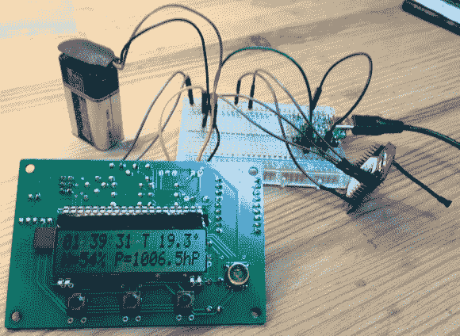

# 为无线数据采集转换气象站套件

> 原文：<https://hackaday.com/2013/01/15/converting-a-weather-station-kit-for-wireless-data-harvesting/>

每个人都喜欢得到一些可以玩的东西作为圣诞礼物。[Thomas]是 Elektor USB 气象站套件的幸运接收者。但是当他组装好所有东西后，乐趣并没有结束。他继续黑进无线数据收集设备。

上面显示的是连接到发射机的气象站板。右边有一个小天线的红色板子是一个 Rovio RN-VX 模块。它能够将串行数据传输到设置的接收端。气象站很容易连接到变送器，因为它向 FTDI USB 芯片提供串行数据。[Thomas]简单地连接电源和地，然后在电路板的 TX 引脚和 Rovio 的 RX 引脚之间添加一条跳线。接收端使用串行转 USB 转换器，从 Rovio 接收器板上的 TX 引脚获取 RX 引脚信号。

我们从其他项目中了解到[这些无线电模块可以连接到 WiFi AP。也许[Thomas 的] hack 的未来版本将允许气象站通过网络与他的服务器通信，不再需要独立的接收器。](http://hackaday.com/2011/11/03/using-websocket-with-pic-microcontrollers/)