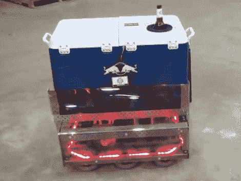

# 酷大师高级啤酒配送系统

> 原文：<https://hackaday.com/2012/07/09/cool-master-advanced-beer-delivery-system/>

酷大师是一个啤酒输送系统，创新渴望建立作为他们今年的红牛创作大赛的参赛资格。这是我们见过的最好的啤酒递送概念之一。不是直接从冰箱里扔给你一杯啤酒，而是直接把冷饮带给你。它甚至能在上菜前打开瓶盖。

机动性由六轮底座提供，允许零转弯半径。冷却器充当机器人的身体，隐藏着一个漏斗，漏斗的侧面装有大量的瓶子。当你想要一瓶啤酒时，机器人靠近你，将下一瓶倾斜到垂直位置，取下盖子，然后在啤酒升降机上抬起容器，直到它挤过冷却器盖子上的橡胶孔。目前，该设备是使用遥控控制器操作的，但总是有增加自主性和从冰箱进货的能力的空间。休息之后不要错过演示视频。

[https://www.youtube.com/embed/Yq1R38fxLxA?version=3&rel=1&showsearch=0&showinfo=1&iv_load_policy=1&fs=1&hl=en-US&autohide=2&wmode=transparent](https://www.youtube.com/embed/Yq1R38fxLxA?version=3&rel=1&showsearch=0&showinfo=1&iv_load_policy=1&fs=1&hl=en-US&autohide=2&wmode=transparent)