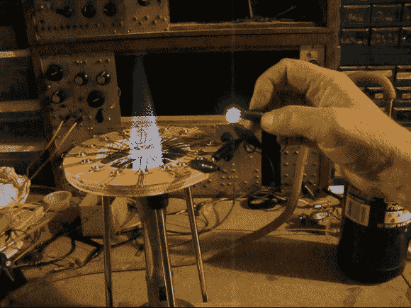

# 氧化铜热电发电机可以点亮 LED

> 原文：<https://hackaday.com/2014/03/26/copper-oxide-thermoelectric-generator-can-light-an-led/>

在 Hackaday 上，我们通常以使用市场上可以买到的构建模块(组件、平台……)的项目为特色。然而，我们并没有展示很多依赖于基本物理原理的黑客，比如上图中的[。](http://sparkbangbuzz.com/copper-oxide-te/copper-oxide-gen3.htm)

在下面嵌入的视频中，[nylesteiner]解释了使用丙烷火焰加热铜线时会形成氧化铜。当两根被氧化的导线相互接触时，当一根导线被加热到比另一根导线更热时，就会产生电流。权衡的结果是，所产生的热电偶会产生小电压，但会产生“高”电流。然而，当你串联 16 个结时，你可以产生足够的电压点亮一个 LED。尽管整个系统在将热能转化为电能方面并不是特别有效，但在我们看来，整体效果仍然令人印象深刻。我们建议我们的读者看看[nylesteiner]的文章和博客，发现他有趣的冒险经历。

[https://www.youtube.com/embed/gNND2pxvxgU?version=3&rel=1&showsearch=0&showinfo=1&iv_load_policy=1&fs=1&hl=en-US&autohide=2&wmode=transparent](https://www.youtube.com/embed/gNND2pxvxgU?version=3&rel=1&showsearch=0&showinfo=1&iv_load_policy=1&fs=1&hl=en-US&autohide=2&wmode=transparent)