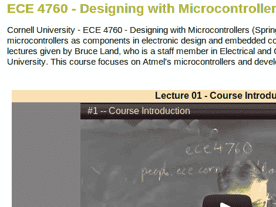

# 康奈尔 ECE 4760 讲座视频现已在线

> 原文：<https://hackaday.com/2012/11/13/cornell-ece-4760-lecture-videos-now-online/>

每当我们听到 ECE 4760，我们就会注意到它。这是因为这个课程产生了大量奇妙的拼凑项目。它在康奈尔大学提供，专注于设计基于微控制器的项目。我们将其视为“如何将一切连接到您的微控制器”指南。好消息是，2012 年春季 ECE 4760 课程的 34 个讲座视频现在可以在线免费观看。当与[课程网页本身](http://people.ece.cornell.edu/land/courses/ece4760/)(概述了阅读材料、实验和家庭作业)相结合时，这变成了一个按照你自己的时间表完成整个课程的机会。

如果你需要一个简短的预览，这里有一些我们从课程中看到的最终项目:[一个数字萨克斯管](http://hackaday.com/2012/05/07/two-saxophone-synthesizer-builds-for-the-price-of-one/)，[一个手写解码器](http://hackaday.com/2012/05/03/machine-learning-lets-micro-decode-your-handwriting/)，和[一个用于锻炼二头肌的触觉反馈单元](http://hackaday.com/2012/03/25/weightlifting-coach-will-nag-you-about-your-form-at-least-until-the-batteries-run-dry/)。

我们仍在努力完成 Nand2Tetris 项目，但我们会将这些讲座放在我们的观察列表中。

[via [Reddit](http://www.reddit.com/r/ECE/comments/12wzf6/designing_with_microcontrollers_lectures_from/)