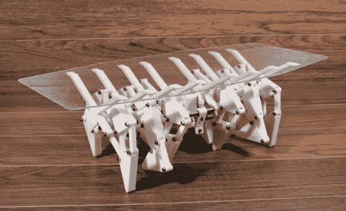

# 可移动的桌子

> 原文：<https://hackaday.com/2013/12/04/crab-ble-a-table-that-walks/>

你有一张沉重的餐桌吗？希望你能自己移动它？早在 9 月份，[Ekaggrat]就着手为今年的北京设计周设计一款。

它基于由[西奥·詹森]设计的令人敬畏的[strand beest](http://hackaday.com/2010/03/24/theo-jansen-like-the-professor-from-gilligan/)，看起来很棒。[Ekaggrat]用 ABS 塑料做了几个“螃蟹桌”的原型，并计划用竹竿做一个全尺寸的，这是设计周的主题。不幸的是，团队没有时间了，无法制作全尺寸模型。原型车用齿轮传动的 DC 马达自行行走，但全尺寸车的计划是简单地推动它。

我们以前见过很多步行桌，但我们喜欢这种设计的机械美感。它会很重——但是想象一下它是用铬合金做的！也许只是塑料可以被镀…休息后留下来看它四处逃窜！

[https://www.youtube.com/embed/XUmu_xiiwMI?version=3&rel=1&showsearch=0&showinfo=1&iv_load_policy=1&fs=1&hl=en-US&autohide=2&wmode=transparent](https://www.youtube.com/embed/XUmu_xiiwMI?version=3&rel=1&showsearch=0&showinfo=1&iv_load_policy=1&fs=1&hl=en-US&autohide=2&wmode=transparent)

现在，我们看到的给你的餐桌蟹腿的唯一问题是，它可能会随着你的食物跑掉，因为它是贝类…