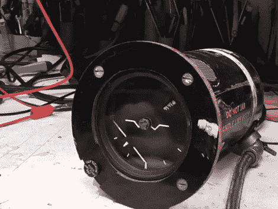

# 打开一个古老的航空电子陀螺仪

> 原文：<https://hackaday.com/2012/07/16/cracking-open-an-ancient-avionics-gyroscope/>

这个人造视界可能来自外星飞船。[Mike]不知何故，他得到了最有趣的设备，这次是一件非常旧的航空电子设备。机械陀螺仪起到了人造地平线的作用，[他将带我们进去看一看](http://www.youtube.com/watch?v=AO7pn3uiWA0)。他花在这上面的时间不像他花在[那台热成像相机](http://hackaday.com/2012/06/22/repairing-a-thermal-imaging-camera/)上的时间那么多，但是这部电子机械的奥德赛一样有趣。

为了获得帮助飞机保持在空中所需的精度(无论如何也要让飞行员消息灵通)，这个设备需要制造得非常好。[Mike]多次评论不同的旋转部件是如何平衡和加工的，以至于它们看起来几乎没有摩擦。似乎很多位置反馈依赖于线绕电阻环，这些电阻环通过一系列非常细的弹簧丝连接到旋转件。当零件旋转时，阻力会发生变化，这就是反馈的来源。一路上还有水银开关帮忙。

他尽力解释，但对我们来说，内部运作仍然是一个很大的谜。休息之后看看能否从视频中得到更清晰的画面。

[https://www.youtube.com/embed/AO7pn3uiWA0?version=3&rel=1&showsearch=0&showinfo=1&iv_load_policy=1&fs=1&hl=en-US&autohide=2&wmode=transparent](https://www.youtube.com/embed/AO7pn3uiWA0?version=3&rel=1&showsearch=0&showinfo=1&iv_load_policy=1&fs=1&hl=en-US&autohide=2&wmode=transparent)

[感谢 Ubergeek85]