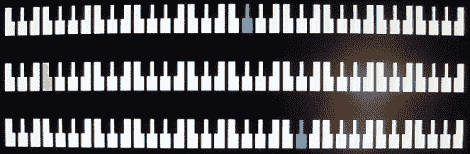

# 从准将 SID 创建 MIDI 合成器

> 原文：<https://hackaday.com/2012/10/18/creating-a-midi-synth-from-a-commodore-sid/>

Commodore SID 是古老的 Commodore 64 中的音频芯片，自发布以来的 30 年中，它已成为经典，并成为让您的芯片调谐的最佳方式之一。由著名合成器设计师[鲍勃·张晞彤]设计，我们看到基于准将 SID 的真正的自制 MIDI 合成器只是时间问题。

因为现在真正的 SID 芯片非常稀少，[杰夫·莱杰]围绕一个运行在袖珍微型计算机上的模拟系统建立了他的 SID 合成器。这个非常酷的微控制器平台运行在 Parallax Propeller 上。[一个仿真 SID](http://forums.parallax.com/showthread.php?118285-SIDcog-The-sound-of-the-Commodore-64-!-(Now-in-the-OBEX)) 在 Propeller 的 8 个内核之一中运行，其余内核保持打开，用于读取 MIDI 音符和在显示器上显示信息。

这个构建硬件部分非常简单；只需一个光隔离器、几个电阻和一个二极管就可以将 MIDI 键盘连接到袖珍迷你电脑。[Jeff]的 MIDI 键盘上的按钮和转盘控制波形、滤波器和包络控制。如果我们自己这么说的话，这是一个非常整洁的设置，如果你在生活中需要更多的 chiptunes，这是完美的。

休息之后你可以看看[杰夫]的视频。

[https://www.youtube.com/embed/XQNfLsm7iEY?version=3&rel=1&showsearch=0&showinfo=1&iv_load_policy=1&fs=1&hl=en-US&autohide=2&wmode=transparent](https://www.youtube.com/embed/XQNfLsm7iEY?version=3&rel=1&showsearch=0&showinfo=1&iv_load_policy=1&fs=1&hl=en-US&autohide=2&wmode=transparent)