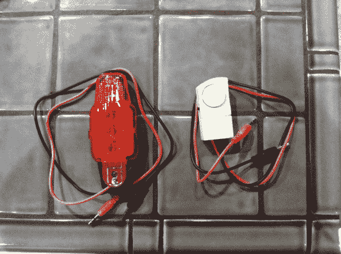

# 花几块钱做的创造性连续性测试器

> 原文：<https://hackaday.com/2014/04/06/creative-continuity-tester-made-for-a-few-bucks/>

没有万用表？对于大多数家用电器的故障排除，连续性测试仪非常方便。事实证明，你可以在一元店几乎不用花钱就能自己制作。

[Carlyn]向我们展示了如何制作两种不同风格的连续性测试仪——一种是使用自行车灯的亮灯型，另一种是使用廉价窗户报警器的蜂鸣器型。导线由 1/8 英寸的音频电缆制成，这两款测试器在当地一元店的价格都不到 5 美元。这是一个非常简单的建造过程，你可能仅仅从这张照片就能看出来，但是[卡琳]也拍下了这个过程中的每一步。

与用 Radio Shack 的组件建造一个相比，这种方法更简单，也更便宜！为利用大规模生产的消费产品而欢呼！

功能不够？不如造一个[会说话的万用表](http://hackaday.com/2014/03/23/say-watt-a-talking-multimeter/)来代替？没有吗？你有没有想过二合一的万用表？向[测雨仪问好！](http://hackaday.com/2014/01/08/mooshimeter-the-why-didnt-i-think-of-that-multimeter/)