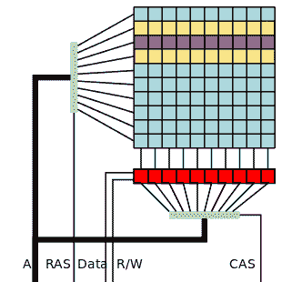

# 用 Rowhammer 滥用创意 DRAM

> 原文：<https://hackaday.com/2015/03/13/creative-dram-abuse-with-rowhammer/>

谷歌的安全分析部门 Project Zero 已经证明，rowhammer 可以被利用来获得某些计算机的超级用户权限。行锤，或[行锤](http://en.wikipedia.org/wiki/Row_hammer)是一种通过快速读访问锤击行来翻转 DRAM 中的位的方法。[Mark Seaborn]和 Project Zero 团队的其他成员通过阅读[Yoongu Kim]2014 年的论文[“翻转内存中的位而不访问它们:](http://users.ece.cmu.edu/~yoonguk/papers/kim-isca14.pdf)
[【DRAM 扰动错误的实验研究】](http://users.ece.cmu.edu/~yoonguk/papers/kim-isca14.pdf) (PDF 链接)了解到 rowhammer。据[Kim]称，内存行业至少从 2012 年就已经知道这个问题，当时英特尔开始为缓解技术申请专利。

“[Row hammer](http://commons.wikimedia.org/wiki/File:Row_hammer.svg#/media/File:Row_hammer.svg)” by [Dsimic](Dsimic) – Own work. Licensed under [CC BY-SA 4.0](http://creativecommons.org/licenses/by-sa/4.0 "Creative Commons Attribution-Share Alike 4.0") via [Wikimedia Commons](//commons.wikimedia.org/wiki/).

这项技术看似简单。动态 RAM 被组织成由行和列组成的矩阵。通过对同一行中的地址执行快速读取，可以翻转相邻行中的位。在左侧的示例图像中，对紫色行的快速读取会导致黄色行中的任何一行发生位翻转。Project Zero 团队发现了一种更具侵略性的技术，他们称之为“双面锤打”。在这种情况下，将对两个黄色行执行快速读取。该团队发现，双面锤击可以在特别脆弱的计算机上导致单行中超过 25 位翻转。

为什么会这样？答案在于 DRAM 的内部结构，以及一点半导体物理学。DRAM 存储位本质上是一个晶体管和一个电容器。通过给电容器充电来存储数据，电容器立即开始泄漏。必须在所有电荷泄漏之前刷新 DRAM。通常这种刷新每 64 毫秒发生一次。更高密度的 RAM 芯片迫使这些电容器比以往更紧密地靠在一起。事实上如此接近，以至于它们可以相互作用。重复读取一行将导致相邻行中的电容器比正常情况下更快地泄漏电荷。如果在刷新之前有足够的电荷泄漏，由该电容器存储的位将翻转。

#### 缓存不是答案

如果您认为由于缓存，内存子系统不应该这样工作，那么您是对的。在正常情况下，重复读取的数据会存储在处理器的数据缓存中，不会接触 RAM。不过缓存可以刷新，这正是 Project Zero 团队正在做的事情。X86 CLFLUSH 操作码确保每次读取都将输出到物理 RAM。

肆意的比特翻转是很好的，但是 Project Zero 团队的目标是利用这项技术。为了实现这一点，他们必须弄清楚他们翻转了哪些位，并以这样一种方式翻转它们，以提高对用户级进程的访问。Project Zero 团队最终想出了两个可行的方法。一个是为了逃离谷歌的 Native Client (NaCL)沙箱。另一个漏洞是作为 x86-64 Linux 机器上的用户空间程序。

#### Native Client 沙盒逸出利用

谷歌将 [Native Client](https://developer.chrome.com/native-client) (NaCL)定义为“在浏览器中高效安全地运行编译好的 C 和 C++代码的沙箱，独立于用户的操作系统。”它被专门设计为一种在浏览器中运行代码的方式，没有代码逃逸到主机系统的风险。让那件事过去一会儿。现在考虑这样一个事实，rowhammer 能够逃离围墙花园并访问物理内存。该漏洞的工作原理是分配 250MB 的内存，对随机地址进行行锤击，并检查位翻转。一旦检测到比特翻转，真正的乐趣就开始了。该漏洞将不安全的指令隐藏在“安全”机构的直接参数中。在论文的一个例子中:

**20ea 0:48 b8 0f 05 EB 0C F4 F4 F4 F4 movabs＄0x F4 F4 F4 F4 40 CEB 050 f，%rax**

从存储器地址 0x20EA0 看，这是一个 64 位值到寄存器 rax 的绝对移动。然而，如果我们不对齐，从地址 0x20EA02 读取指令，现在它是一个系统调用-(0F 05)。NaCL escape 漏洞正是这样做的，它运行隐藏在看似安全的指令中的 shell 命令。

#### Linux 内核权限提升漏洞

Project Zero 团队使用 rowhammer 为 Linux 进程提供了对所有物理内存的访问。这个过程比利用 NaCL 更复杂，但基本思想围绕着[页表条目](http://en.wikipedia.org/wiki/Page_table) (PTE)。因为 Linux 的页表的底层结构是众所周知的，所以 rowhammer 可以用来修改用于将虚拟地址转换为物理地址的位。通过仔细控制翻转哪些位，攻击进程可以将自己的页面重新定位到 RAM 中的任何位置。该团队使用这种技术将/bin/ping 重定向到他们自己的 shell 代码。因为 Ping 通常以超级用户权限运行，所以 shell 代码可以做任何它想做的事情。

#### TL；速度三角形定位法(dead reckoning)

Rowhammer 是一个令人讨厌的漏洞，但天还没有塌下来。Google 已经通过删除对 CLFLUSH 操作码的访问来修补 NaCL，因此 NaCL 不会受到任何当前已知的 rowhammer 攻击。Project Zero 没有进行详尽的测试来找出哪些计算机和 RAM 制造商容易受到 rowhammer 的攻击。事实上，他们只能在笔记本电脑上翻转比特。他们尝试的台式机使用 ECC RAM，这可能会纠正发生的位翻转。ECC RAM 会有所帮助，但不能保证免受 rowhammer 攻击——尤其是在发生多次位翻转时。最好的保护是新机器——新的 RAM 技术包括缓解技术。LPDDR4 标准包括“目标行刷新”(TRR)和“最大激活计数”(MAC)，这两种方法都可以避免 rowhammer 漏洞。如果我们听过的话，这是一个购买新笔记本电脑的好借口！

如果你想在家玩，Project Zero 团队在 GitHub 上有一个 [rowhammer 测试。](https://github.com/google/rowhammer-test)