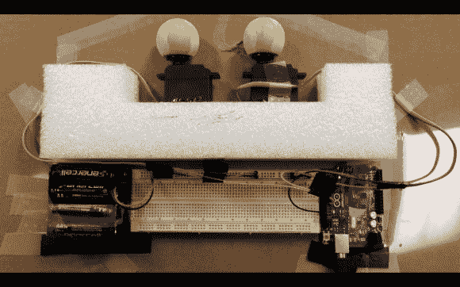

# 带微软 Kinect 的恐怖猫眼

> 原文：<https://hackaday.com/2014/08/04/creepy-cat-eyes-with-a-microsoft-kinect/>

有没有感觉到有人在看着你？就像，在你内心深处的某个地方，你能感觉到有什么东西在窥视你？利用这种偏执，这个[计算机科学研究生项目](http://www.instructables.com/id/Tracking-Cat-Eyes-via-Kinect/?ALLSTEPS)是在马里兰大学的“有形互动计算”课上由两名聪明的年轻学生[乔希和【理查德】在 HCIL[黑客空间](http://www.cs.umd.edu/hcil/)的帮助下创建的。

他们的教授 Jon Froehlich 博士]希望学生们“无缝耦合比特和原子的双重世界”，创造出“探索交互式计算的物质性”的东西这个相对简单的想法就做到了这一点，保证了一些好的反应。

正如你可能已经从标题中推断出的那样，这个项目使用一个[微软 Kinect](http://en.wikipedia.org/wiki/Kinect) 来跟踪附近人的运动。然后，输出被转换成安装的眼球的可操作控制，产生从猫机器人海报辐射出的令人毛骨悚然的振动。

纸板后面是嵌入 Arduino 电路的机械大脑，两个[标准伺服塔 Pro SG-5010 电机](http://www.adafruit.com/products/155)，八节 AA 电池，一个 IC 试验板，以及(当然)一个微软 Kinect。“第三只眼”传感器观察着，等待着有人走过。

一旦一个不知情的人出现，Arduino 就会启动处理程序，并转动木眼来跟踪这个走过附近的人。而这仅仅是开始。很快，其他类型的电影、电视或网络红人 Youtube 海报也会被砍成类似的东西。

所以。如果人们看到这样的眼睛盯着他们，你认为什么类型的电影、节目或广告会把他们吓个半死？如果有意见请告诉我们。

另外，看看这个视频。

[https://www.youtube.com/embed/scfLShbUUH8?version=3&rel=1&showsearch=0&showinfo=1&iv_load_policy=1&fs=1&hl=en-US&autohide=2&wmode=transparent](https://www.youtube.com/embed/scfLShbUUH8?version=3&rel=1&showsearch=0&showinfo=1&iv_load_policy=1&fs=1&hl=en-US&autohide=2&wmode=transparent)