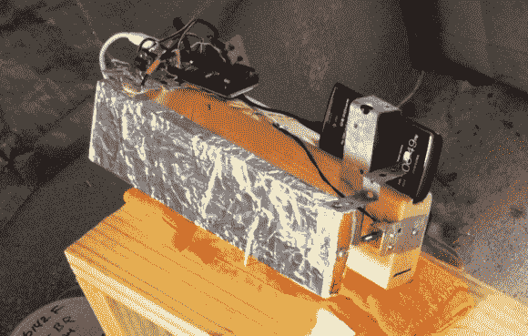

# 小动物摄像头从一部旧手机上黑下来的。

> 原文：<https://hackaday.com/2013/02/25/critter-cam-hacked-from-an-old-cellphone/>

(阿特·巴里奥斯)不断有夜间访客来搜查他的狗的食物储存箱。这是一个塑料盆，有一个可以锁住的盖子，但是小动物们把它打翻了，盖子也砰的一声打开了。他想找出哪种动物是罪魁祸首，所以他用一部旧手机黑进了一个自动摄像系统。

你可以在上图中看到他使用的大部分硬件。左边有一个 Arduino。这监控着他加在食物储存容器盖子上的开关。它打开时会触发系统，打开 LED 灯并拍照。

触摸屏按钮用于触发快门。这就是所有锡箔的意义。一些实验让[Art]意识到，如果有足够多的箔片，金属“手指”可以在屏幕上显示。为了移动金属支架，他使用了一个螺线管。他面临的最后一个问题是让手机屏幕保持清醒。他发现对充电器进行电源循环可以达到目的。Arduino 使用额定电源继电器进行管理。

该系统成功捕捉到了一群浣熊尽情享用美味食物的图像。