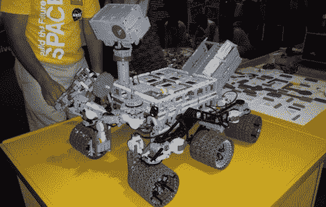

# 好奇号登陆了，这是乐高版的

> 原文：<https://hackaday.com/2012/08/06/curiosity-landed-heres-the-lego-version/>

火星科学实验室还没有停下来一天，就已经有*好奇号-* 激发的建造滚滚而来。[威尔]和[道格][为美国宇航局肯尼迪航天中心的“构建未来”太空活动建造了一个乐高模型的*好奇号*漫游车](http://battlebricks.com/curiosity/)。这个缩小版的*好奇号*上的一切都完全由乐高制成，包括四个动力轮、电动桅杆和铰接的可控臂。

乐高漫游者包含 7 块 NTX 积木、13 个马达、两个动力功能马达，以及 1000 多块不用任何胶水粘在一起的乐高积木。漫游者由两个操作员遥控。司机控制四个电动转角轮的旋转和方向，而另一名操作员使用乐高建造的类似瓦尔多的机械手来移动好奇号的桅杆和手臂。每个控制器都通过蓝牙连接与漫游车通信。

我们一直在想什么时候我们会看到一个受*好奇号-* 启发的摇杆转向架机器人，我们很高兴第一个刚好是乐高积木。让[威尔]和[道格]为他们提交的*好奇号的*登陆火星的时间是锦上添花。

休息过后，你可以看到乐高*好奇号*正在运行。

[https://www.youtube.com/embed/2Kfoa39XzZY?version=3&rel=1&showsearch=0&showinfo=1&iv_load_policy=1&fs=1&hl=en-US&autohide=2&wmode=transparent](https://www.youtube.com/embed/2Kfoa39XzZY?version=3&rel=1&showsearch=0&showinfo=1&iv_load_policy=1&fs=1&hl=en-US&autohide=2&wmode=transparent) [https://www.youtube.com/embed/9wrt5f2SrpQ?version=3&rel=1&showsearch=0&showinfo=1&iv_load_policy=1&fs=1&hl=en-US&autohide=2&wmode=transparent](https://www.youtube.com/embed/9wrt5f2SrpQ?version=3&rel=1&showsearch=0&showinfo=1&iv_load_policy=1&fs=1&hl=en-US&autohide=2&wmode=transparent)