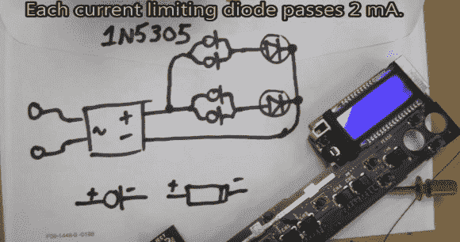

# 限流二极管的使用和指南

> 原文：<https://hackaday.com/2014/01/06/current-limiting-diode-use-and-tutorial/>

这种情况并不经常发生，但当你面临维修时，你不知道电源，但你知道你必须驱动 LED 背光，你会怎么做？当面临这种困境时，埃里克·瓦萨托尼克的解决方案是为模糊性而设计。在这个有趣的黑客修复中，埃里克需要为一辆旧车的立体声液晶显示器恢复背光。首先，他通过插入一个小型全波桥式整流器来保证他使用的是 DC 电源。然后知道他需要 4 mA 来为背光照明的每个 LED 供电，他使用了一些 1978 年的老式限流二极管，设计为每个二极管通过 2mA，而不管电压源如何，当然是在限制范围内。

当然，这是一个简单的黑客修复，但值得被列入任何人的锦囊妙计。像大多数黑客一样，总有知识可以获取。[Eric] [分享第二个视频，他使用曲线跟踪器](http://www.youtube.com/watch?v=hSVZkds14vA)和一些数据表来了解这些旧器件实际上是如何工作的。这些老式的 1N5305 限流二极管稳压器由一个 JFET 构成，其栅极带有一个内部反馈电阻，可保持固定的电流输出。为了证明这种元件的简单性，[Eric]使用 JFET 和反馈电位计构建了一个限流电路，然后在曲线跟踪器上确认其功能。他制作的模拟电路运行良好。

这种修复可以赚一点钱，这总是一个额外的奖励，接受者从未报告过任何问题，所以修复被认为是成功的。你可以在休息后观看这两个视频的链接，另外，如果在同样的情况下，听听你的想法会很有趣。

[https://www.youtube.com/embed/Rit4LieOkUU?version=3&rel=1&showsearch=0&showinfo=1&iv_load_policy=1&fs=1&hl=en-US&autohide=2&wmode=transparent](https://www.youtube.com/embed/Rit4LieOkUU?version=3&rel=1&showsearch=0&showinfo=1&iv_load_policy=1&fs=1&hl=en-US&autohide=2&wmode=transparent)

[https://www.youtube.com/embed/hSVZkds14vA?version=3&rel=1&showsearch=0&showinfo=1&iv_load_policy=1&fs=1&hl=en-US&autohide=2&wmode=transparent](https://www.youtube.com/embed/hSVZkds14vA?version=3&rel=1&showsearch=0&showinfo=1&iv_load_policy=1&fs=1&hl=en-US&autohide=2&wmode=transparent)