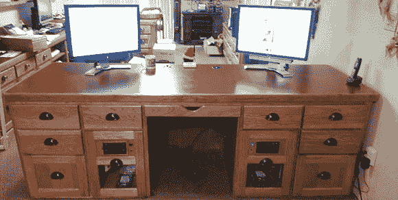

# 定制办公桌是一个定制的电脑机箱

> 原文：<https://hackaday.com/2012/12/17/custom-desk-is-a-custom-computer-case/>

[Paul]一直在考虑他的完美电脑桌的想法，当有机会改造他的办公室时，他决定是时候建造他梦想中的电脑包了。

桌子本身是由山核桃木制成的，上面有一个与[Paul]工作空间中的其他工作台相匹配的福米卡台面，两个最大的抽屉容纳了一个 ATX 主板、电源、磁盘驱动器和一对 CD 驱动器。桌面上有两个 24 英寸的显示器——每台电脑一个——和一个内置的 USB 集线器，允许[Paul]给他的手机充电或使用外部驱动器。

作为一名计算机技术人员，[Paul]需要一种连接客户硬盘的方法。他在右上方的抽屉里放了两个 Startech UniDock2U USB 转 SATA 和 IDE 转换器。这是他最常用的功能之一，非常便于复制裸驱动器。

[Paul]的桌子中还包括一个大型的 UPC，以及一对 120 毫米的机箱风扇，通风到桌子的前面。这是一件非常棒的作品，可拆卸的电脑机箱让清洁和升级变得轻而易举。