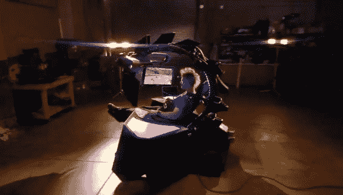

# 带有 Kinect 和触觉反馈的定制赛车椅

> 原文：<https://hackaday.com/2014/08/26/custom-racing-chair-with-a-kinect-and-haptic-feedback/>

比特马戏团的人又来了。这一次是用[未来派赛车模拟器](http://twobitcircus.com/productions/stunt-show-bestbuy-simulator/)让用户控制体验。它是由[Brent Bushnell]和[Eric Gradman]以及加州洛杉矶的一些工程师和设计师开发的。沉浸式游戏椅在设计中利用了一个实际的赛车座椅，并添加了脚瓣，让驾驶员感觉他们实际上是在一场真正的比赛中。冷却风扇被放置在顶部，用于触觉反馈，微软 Kinect 也被集成到系统中，以检测手势，控制各种屏幕上的内容。

该团队在 30 天内完成了这个项目，当时来自百思买的挑战是想看看他们是否能创造未来的观看体验。尽管围绕显卡、显示器和发货日期制造了障碍，但问题在整个时间框架内不断出现。他们完成了这项工作，并期待将他们的工作整合到像 Dave & Buster's 这样的餐厅和其他设施中，如拱廊和酒吧(至少这是镇上流传的谣言)。围绕这款设备制作的 5 集迷你剧将在广告之后播出:

[https://player.vimeo.com/video/61396603](https://player.vimeo.com/video/61396603)[https://player.vimeo.com/video/61396604](https://player.vimeo.com/video/61396604)[https://player.vimeo.com/video/61396606](https://player.vimeo.com/video/61396606)[https://player.vimeo.com/video/61396607](https://player.vimeo.com/video/61396607)[https://player.vimeo.com/video/61396608](https://player.vimeo.com/video/61396608)

Two Bit Circus 还在激光投影仪和微软 Kinect 的帮助下开发了这个名为“T0”人类小行星“T1”的游戏。