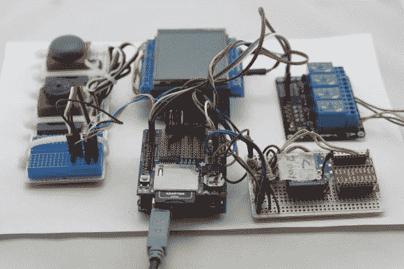

# THP 参赛作品:使用这款 WiFi XBee 设置，将能耗降低 30%

> 原文：<https://hackaday.com/2014/07/23/cut-energy-consumption-by-30-percent-with-this-wifi-xbee-setup/>

实话实说吧。交电费真讨厌。支付的金额总是太多，建筑内的温度很少被设置在舒适的水平。但是现在，在这个 [DIY 气候控制系统](http://hackaday.io/project/1980)的帮助下，电力用户终于可以高兴地知道，他们的家(或商业空间)的加热和冷却过程可以通过使用 XBee 远程套件和一个称为分区的过程来轻松控制。

这个项目背后的团队是[道格]、[本杰明]和[卢卡斯]。他们希望通过将他们的工作开源到社区中来解决由移动的太阳引起的不一致的温度问题。

他们的 XBee 系统运行在一个网状网络上，这使得它成为一个完美的工具，可以感知和交流房屋中的哪个区域太热或太冷。一旦收集了数据，XBee 模块就以无线方式将信息传递给彼此，直到它到达一个中央 Arduino 网守；然后由它来决定是否对房间进行加热、通风或空调。

更不用说下面公布的所有附加优势了:

首先，你可以连接 TMP36 (PDF)等[温度 IC，而无需购买额外的器件。更好的是，XBee 可以通过编程进入睡眠状态，从而节省电池寿命。这意味着整个模块可以使用可充电的 AAA 电池运行。](http://www.analog.com/static/imported-files/data_sheets/TMP35_36_37.pdf)

更进一步，它可以在不同的端口被编码以读取其他设备。这很棒，因为它使设置有可能打开和关闭连接到该模块的设备，将其转换为互连设备的网络集线器。

这种方法不仅能让你参与到拯救地球的行动中，还能让你的家、仓库或办公楼在这个过程中保持一个更舒适的水平，这是一个真正的双赢。

* * *

 **本帖介绍的项目是[黑客大奖](http://hackaday.io/prize)中的一个参赛项目。建造一些令人敬畏的东西，赢得太空之旅或数百个其他奖品。**