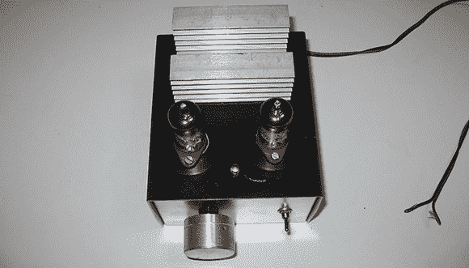

# 可爱的小放大器有一个管预

> 原文：<https://hackaday.com/2012/12/04/cute-little-amplifier-has-a-tube-pre/>

虽然你不会抓住我们与音响发烧友关于电子管与固态放大器的声音质量的争论，但有一个普遍的共识，电子管放大器听起来比他们的晶体管兄弟好得多。然而，实际上构建一个全电子管放大器比围绕普通 IC 构建的放大器要难一些——需要处理变压器，当然还有非常高的电压。一种既能轻松获得电子管声音又能保持集成电路简单性的解决方案是混合放大器，或者电子管前置放大器与固态功率部分相结合。正如【达尼洛】向我们展示的[他的混合电子管放大器设计](http://www.danilolarizza.com/?p=105)(意大利语，[翻译](http://translate.google.com/translate?sl=it&tl=en&js=n&prev=_t&hl=en&ie=UTF-8&layout=2&eotf=1&u=http%3A%2F%2Fwww.danilolarizza.com%2F%3Fp%3D105&act=url))一样，它们很容易制造。

[Danilo]的设计使用两个 ECC86 用于左右声道，由 12 伏电源供电。每个通道通过一个管道发送，然后由 TDA2005 20 瓦功率放大器放大。插入 CD 播放器后，结果是一个清晰、温暖的声音，可以通过扬声器发出很大的功率。