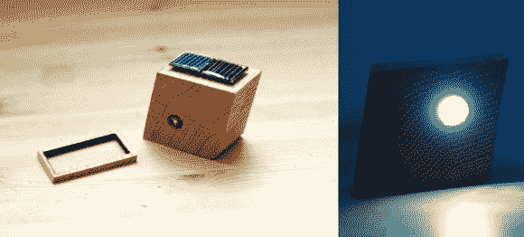

# 可爱的倾斜光束手电筒为您的天井桌增添了一些有趣的互动

> 原文：<https://hackaday.com/2014/03/17/cute-tilt-beam-flashlight-adds-some-fun-interaction-to-your-patio-table/>

这是一个可爱的小 LED 灯，为你的下一次聚会做准备，它是一块太阳能充电的木头……里面有一个运动控制灯！

[Zach DeBord]在看到一个商业产品后，决定尝试构建自己的版本。他拿起一块橡木，切掉顶部边缘，然后用激光从那片木头上切割出太阳能电池板的精确轮廓。这使得他可以在中间钻一个很大的孔来安装电路。

他使用了一个漂亮的 8 毫米大 LED，带有一个 0.09V-5V 的小型 DC 升压电路，一个水银倾斜开关，一个 4.5V 的太阳能电池，一个 2.7V 的 10MF 超级电容器，外加一个二极管和 100 欧姆的电阻。他把最上面的一片木头粘回原位，然后用树脂把整个东西封起来——你几乎看不到切割痕迹！

白天让灯的太阳能电池板朝上，当夜晚来临时，只需翻转灯的边缘，就能照亮你的桌子。由于它是一个超级电容器，电路可能会比你持续更长的时间。虽然我们不太确定充电后灯能亮多久。

[https://www.youtube.com/embed/QLKRXOhPCdg?version=3&rel=1&showsearch=0&showinfo=1&iv_load_policy=1&fs=1&hl=en-US&autohide=2&wmode=transparent](https://www.youtube.com/embed/QLKRXOhPCdg?version=3&rel=1&showsearch=0&showinfo=1&iv_load_policy=1&fs=1&hl=en-US&autohide=2&wmode=transparent)

或者如果你真的想给你的客人留下深刻印象，为什么不做一个[太阳能遥控割草机呢？](http://hackaday.com/2013/04/07/solar-powered-robot-mows-your-lawn-while-you-chill-indoors/)