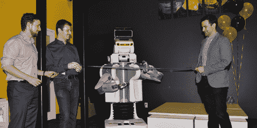

# 用机器人和 Oculus Rift 切割丝带

> 原文：<https://hackaday.com/2014/07/21/cutting-ribbons-with-robots-and-a-oculus-rift/>

2014 年 6 月 26 日，Clearpath Robotics 打开了他们全新的 12，000 平方英尺机器人巢穴的大门，[拿出一台 PR2 剪彩](http://www.clearpathrobotics.com/blog/grand-opening-pr2-ribbon-cutting/)，欢迎所有人进入。除了编程“定位并摧毁”带状序列，联合创始人还选择使用 Oculus Rift 来控制机器人用挥舞的手臂撕裂材料。

这是让机器人杰克利用 Kinect 2.0 完成的，Kinect 2.0 通过 [rosserial_windows](http://wiki.ros.org/rosserial_windows) 提供骨骼跟踪数据，这是一套基于 windows 的机器人操作系统的扩展，我们在 1 月份听说过。该软件收集了一系列数据点，每个数据点都有一个 X，Y，Z 分量，使[杰克]能够在三维空间中找到自己。然后，数据被收集并直接发布到 PR2 的大脑中。注入一点 python 代码，这个生物就能够为移动它的手臂选择路线。

因此，只要走到 Kinect 2.0 前面，戴上 Oculus Rift 耳机，任何人都可以遥控[杰克]四处移动，并对着迎面而来的彩带挥舞手臂。一旦完成，[杰克]就会离开现场，回到新创建的机器人巢穴，到处留下尼龙和聚酯碎片。

完整系统的早期(未平滑)版本可以在中断后看到:

[https://www.youtube.com/embed/EqDRGLMm_Ao?version=3&rel=1&showsearch=0&showinfo=1&iv_load_policy=1&fs=1&hl=en-US&autohide=2&wmode=transparent](https://www.youtube.com/embed/EqDRGLMm_Ao?version=3&rel=1&showsearch=0&showinfo=1&iv_load_policy=1&fs=1&hl=en-US&autohide=2&wmode=transparent)

该系统的模拟版本也可以在上面的链接中找到。