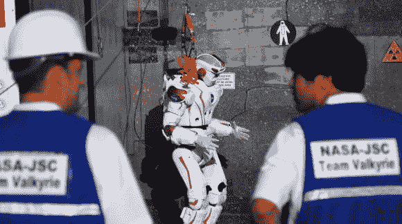

# DARPA 机器人挑战赛第一天

> 原文：<https://hackaday.com/2013/12/20/darpa-robotics-challenge-trials-day-1/>

今天是在佛罗里达州霍姆斯特德-迈阿密赛道举行的 DARPA 机器人挑战赛两天测试的第一天。机器人挑战赛创建于 T2 福岛核事故之后，旨在推进机器人技术的发展。试验范围从驾驶汽车到清理废墟，再到凿穿墙壁。机器人根据他们在测试中的表现得分。这一天的大部分时间都在等待团队准备机器人。然而，也有一些激动人心的时刻，一名挑战者从一堵[堆积的煤渣砖墙上摔了下来。](http://www.youtube.com/watch?v=f--O3xNordA#t=28500)

上图是美国国家航空航天局的瓦尔基里来自 JSC 的 JPL。[我们本月早些时候报道过瓦尔基里](http://hackaday.com/2013/12/12/robot-battle-for-the-big-leagues-valkyrie-and-the-darpa-challenge/#more-109599)。毫无疑问，瓦尔基里是机器人中长得比较好看的一个，但今天它被证明是只秀不做，在第一天的测试中没有得到任何分数。第一天领先的是来自东京初创公司 Schaft inc .的新机器人 Schaft Team，Schaft 在第一天就得了 18 分。排在第二位的是麻省理工学院的 T4 队 T5，得了 12 分。第三名目前由 TRACLabs 队以 9 分保持。随着明天第二天的审判，这一切都将改变。直播将在美国东部时间上午 8 点到下午 7 点在 DARPA 的机器人挑战赛页面上进行。

[https://www.youtube.com/embed/Z9_hegb_JJE?version=3&rel=1&showsearch=0&showinfo=1&iv_load_policy=1&fs=1&hl=en-US&autohide=2&wmode=transparent](https://www.youtube.com/embed/Z9_hegb_JJE?version=3&rel=1&showsearch=0&showinfo=1&iv_load_policy=1&fs=1&hl=en-US&autohide=2&wmode=transparent)