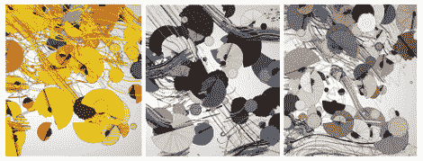

# 你咖啡机里的数据变成了艺术

> 原文：<https://hackaday.com/2012/08/29/data-from-your-coffee-maker-turned-into-art/>

这是你的咖啡冲泡时的样子。上面看到的三个不同的艺术作品是根据高端咖啡机不同部分的数据生成的[。这不是廉价的地下室单开关滴灌机(我们为](http://www.shinymetalthings.net/thenakedespresso/) [NES 改造](http://hackaday.com/2012/08/03/super-nincoffee-jr/)保留这些)，而是顶级的浓缩咖啡机。在你抱怨之前，我们会提醒你这个项目是制造商的营销手段。但我们仍然认为它很有趣，所以请继续阅读，或者在休息后直接跳到视频。

我们不确定传感器是正常情况下包含在机器中，还是在黑客入侵期间添加的。Arduino 从两个流量计、一个蒸汽指示器 LED 和三个热敏电阻获取酿造过程的数据。测量值被发送到一个处理应用程序，该应用程序将它们转换成上图所示的艺术作品。结果是一个宽屏显示器，旨在将你睡眼惺忪地等待早上喝咖啡变成有趣的事情。

[https://www.youtube.com/embed/k1YYesjAen4?version=3&rel=1&showsearch=0&showinfo=1&iv_load_policy=1&fs=1&hl=en-US&autohide=2&wmode=transparent](https://www.youtube.com/embed/k1YYesjAen4?version=3&rel=1&showsearch=0&showinfo=1&iv_load_policy=1&fs=1&hl=en-US&autohide=2&wmode=transparent)

[谢谢马修]