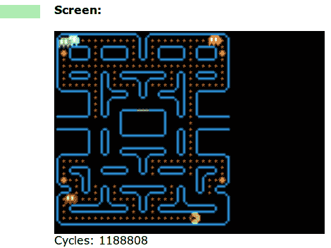

# DCPU 16 运行吃豆人

> 原文：<https://hackaday.com/2012/04/20/dcpu-16-running-pac-man/>

如果你一直在努力想用 DCPU 16 做些什么，这可能会激发你写一个经典游戏的克隆版。

这个版本的吃豆人是用 16 色调色板的精灵系统编写的。它运行在一个基于 HTML 的仿真器中，因此您甚至可以摆弄汇编代码来帮助您弄清楚它是如何工作的。但是如果你不喜欢写这种机器关闭的代码，你可以点击“运行”按钮，用你的键盘箭头来玩一两个关卡。你会注意到到目前为止只有一个游戏板可用，有些东西仍然不见了，就像那个熟悉的 waka-waka，因为他吞噬了点。如果你想扩展这个版本的特性，请告诉我们。

如果你错过了，这个模拟器运行的是来自 Notch 新游戏、0x10c([)的 DCPU-16 规格。我们不知道这将会如何发展，但是早点加入这个游戏会有回报，它会像《我的世界》一样受欢迎。](http://hackaday.com/2012/04/08/getting-12-year-olds-to-learn-assembly-programming/)