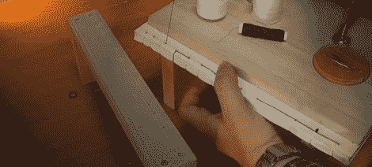

# 通过装订自己的书籍来应对 pdf 的恐惧

> 原文：<https://hackaday.com/2012/07/16/dealing-with-the-horrors-of-pdfs-by-binding-your-own-books/>

查看一些 pdf 格式的数据手册、期刊文章，甚至整本书都是一件痛苦的事情。你不仅要面对 PDF 阅读器的折磨(我们正看着你呢，Adobe)，而且一份纯电子文档还缺少枯树格式的漂亮触觉界面。[samimy]制作了一个非常专业的视频,向我们展示了如何将我们方便但笨拙的 pdf 文件变成平装书，非常适合作为非常容易获取的离线参考资料。

[samimy]的构建基本上是几块木头和 C 夹钳，旨在将打印的 PDF 压缩在一起。在书脊上钻了几个洞后，他用非常结实的线把书页缝在一起，并在书脊上涂了一点胶水。从印刷机上取下书页后，[萨米]在书脊上贴了一条胶带，这样就有了一本非常好看的平装书。

虽然[萨米]正在用他的装订夹具制作数据表，但我们看不出有什么理由不能用他的夹具制作出更大的书。几页大理石纹纸和一个 T2 皮革封面会产生一件美丽而实用的艺术品，在你离开后很久还会存在。