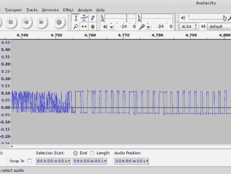

# 使用 PC 声卡解码 RF 链路

> 原文：<https://hackaday.com/2012/07/02/decoding-rf-link-using-a-pc-soundcard/>

[Ray]想要使用微控制器向一些无线电源插座发送信号。他没有点击遥控器上的按钮[，而是使用射频板来模拟信号](http://rayshobby.net/?p=3381)。用这种方法有两个障碍要克服。首先是确保你的射频模块工作在正确的频率上。第二是得到从遥控装置发出的代码。

现在，您可以将示波器连接到发射机上，观察信号的时序。但是大多数业余爱好者在他们的地下室或车库商店里没有那种高端测试设备。[Ray 的]方法使用了一些我们都有的东西:声卡和一些开源软件。他将 RF 接收器的数据引脚连接到音频插头，并将其插入电脑的线路输入插孔。当他按下发射器上的按钮时，他用 Audacity 录下了信号。这种方法不仅捕获数据，而且音频编辑程序自带的时间戳让他可以轻松地计算出每个信号的时间。

你可以用这种音频分析技术做的事情有点令人惊讶。今年早些时候，我们看到它被用来测量 DSLR 相机的反应时间。

[https://www.youtube.com/embed/ZoJV60a22Eg?version=3&rel=1&showsearch=0&showinfo=1&iv_load_policy=1&fs=1&hl=en-US&autohide=2&wmode=transparent](https://www.youtube.com/embed/ZoJV60a22Eg?version=3&rel=1&showsearch=0&showinfo=1&iv_load_policy=1&fs=1&hl=en-US&autohide=2&wmode=transparent)