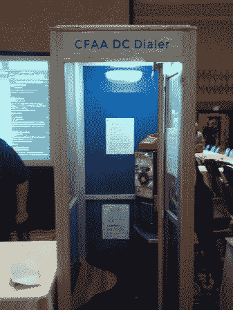
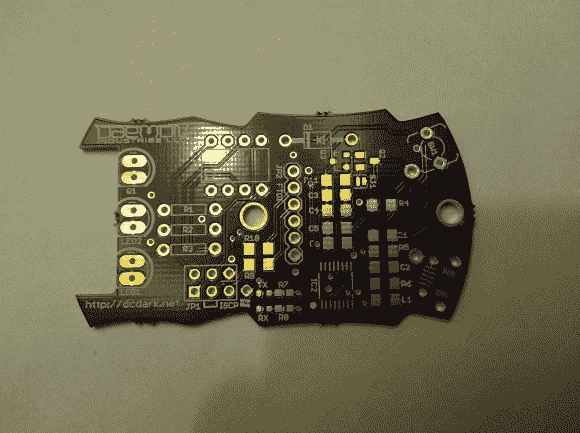
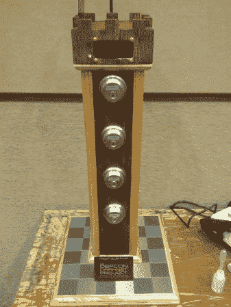

# DEF CON:入侵硬件和汽车

> 原文：<https://hackaday.com/2013/08/02/def-con-hacking-hardware-and-cars/>

DEF CON 的第一天挤满了黑客硬件和汽车。我开始了解为什么你的车没有你想象的那么安全，撬开一些锁，发现毕竟有电子防盗徽章。请继续阅读所有细节。

## 峰会

周四晚上以一个聚会结束:一个为 EFF 的筹款晚会。喝啤酒，捐款，度过美好时光。来自 [Codame](http://codame.com "Codame") 的人们展示了互动艺术装置，[双核](http://dualcoremusic.com "Dual Core")提供了一些很棒的 nerdcore 娱乐。

EFF 运行了一个 DC 拨号电话亭，鼓励与会者打电话给他们的代表，并要求他们支持亚伦的法律。如果你在美国，你应该阅读更多关于亚伦的法律和如何联系你的代表。EFF 有一个很好的概述[这里](https://action.eff.org/o/9042/p/dia/action/public/?action_KEY=9005 "The Computer Fraud and Abuse Act is Broken")。

The CFAA DC Dialer let attendees make free calls to their representatives.

## 硬件黑客村

硬件黑客村今天挤满了人，许多工具包被出售和建造。DEF CON Darknet Project 徽章是在这里首次亮相的装备之一。受[ [丹尼尔·苏亚雷斯](http://www.thedaemon.com "The Daemon") ]的书《守护进程》的启发，这个项目鼓励与会者通过完成任务来结识朋友和学习技能。[ [斯密提](https://twitter.com/SmittyHalibut) ]给我介绍了这块板的概况，它使用 ATTiny85，通过红外与其他徽章进行通信。

The Darknet Badge PCB

配对徽章可让您追踪已认识的人。也有使用徽章的技能任务。其中两个用于装配徽章本身，一个用于通孔部分，一个用于可选的表面安装部分。一个名为 Rook 的开锁工具会记录你开了哪些锁，并将数据传送到你的徽章上。徽章上的数据可以与暗网网站同步以获得经验值。固件几乎完成了，整个项目将很快作为开源硬件发布。

The Rook is an interactive lockpicking challenge that interfaces with the Darknet Badge

## DLP 3D 打印

【PacManFan】给我看了他的[创作工坊](http://reprap.org/wiki/Creation_Workshop "Creation Workshop") 3D 打印软件。该软件旨在使用 UV 感光墨水和 DLP 投影仪进行打印。这种工艺的优点包括高分辨率印刷和每层固定的印刷时间。他的软件与 g 代码兼容，但增加了特殊的标记，用于在 DLP 投影仪上显示图像。这使得你可以使用目前可用的硬件，如[斜坡](http://reprap.org/wiki/RAMPS_1.4‎ "RAMPS")平台，以及紫外线固化树脂。软件用 C#编写，开源，可在 [Github](https://github.com/Pacmanfan/UVDLPSlicerController "Creation Workshop on Github") 上下载。

## 汽车黑客

[查理·米勒]和[克里斯·瓦拉塞克]做了一个关于黑客汽车的精彩演讲。他们把注意力集中在丰田和福特汽车上，并设法在这两种汽车上取得了一些令人印象深刻和危险的成就(几天前我们[预览了这些成就](http://hackaday.com/2013/07/26/defcon-presenters-preview-hack-that-takes-prius-out-of-drivers-control/))。黑客认为攻击者可以访问车内的控制器局域网总线(CAN 总线)。CAN 用于汽车控制器之间的通信，通过伪造 CAN 信号可以欺骗这些控制器。从一台笔记本电脑上，他们能够操纵方向盘，刹车，喇叭，并使刹车失灵。

通过对这些制造商车辆的诊断工具进行逆向工程，他们能够获得统一诊断服务安全访问密钥。使用这些功能，您可以执行与安全相关的操作，包括用修改后的固件刷新车辆控制器。福特目前正在与他们合作解决这些问题，但丰田声称他们只关心远程攻击，这些攻击不是问题。

## DEF CON:纪录片

这部 DEF CON 纪录片昨天首映，现在可以以种子的形式获得。这里可以抢[。](https://www.defcon.org/html/links/dc-torrent.html "DEF CON: The Documentary")

明天我将会报道更多的村庄，比赛区域，以及一两次谈话。