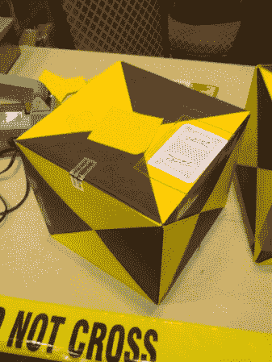
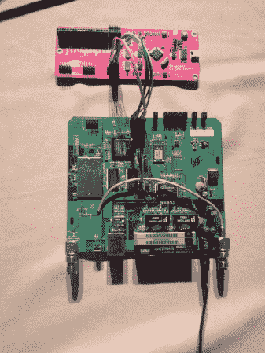

# DEF CON:篡改证据、争论和嵌入式会谈

> 原文：<https://hackaday.com/2013/08/04/def-con-tamper-evidence-contests-and-embedded-talks/>

在 DEF CON 的第二天，我检查了防篡改设备、竞赛区和一些嵌入式会谈。休息后请阅读所有相关内容。

## 篡改明显的村庄

今年是防篡改村的第一次运行。该村有各种防篡改设备，包括胶带、贴纸和封条。志愿者提供了工具、溶剂以及如何绕过各种装置而不引爆它们的说明。

显窃启挑战让团队尝试打开一个装有各种显窃启设备的盒子，然后重新组装。评委们根据安全装置被绕过的程度来评估这些盒子。

The Tamper Evident Challenge box, before being tampered with.

## 内容

在竞赛室，公司和志愿者为拥有不同技能的人举办各种竞赛。寻宝游戏的范围从得到一个莫霍克发型到得到一个飞机出口滑梯。游戏玩家在 Hack Fortress 中与黑客合作，在这款游戏中，当团队中的黑客完成黑客挑战时，团队堡垒玩家可以获得奖金。崩溃与编译是一个喝编码酒的游戏，在这个游戏中，竞争者试图解决一个编程问题，每次他们的代码崩溃时都要喝酒。

## 嵌入式会谈

[托德·曼宁]和[扎克·拉尼尔]在名为“GoPro 或 GTFO”的演讲中展示了他们的 GoPro 黑客技术。他们设法在相机上获得了一个 root shell，并发现所有的服务都以 root 用户身份运行。他们还展示了这种设备可以用于监视。他们将在 Github 上发布他们的资源和信息。

乔·格兰德(Joe Grand )就他的新设备发表了一次演讲:T2(Joe gulator)。这个开源硬件项目有助于自动发现调试接口。目标电压选择和输入保护是内置的，以防止你烧坏你的目标板。现在，它可以通过 24 个未知通道找到 JTAG 和 UART 接口。[Joe]通过在 WRT54G 无线路由器上发现 UART 和 JTAG 端口来演示设备。

The JTAGulator finding a WRT54G’s JTAG port.

DEF CON 21 明天就结束了，我会在会上分享更多很酷的东西。