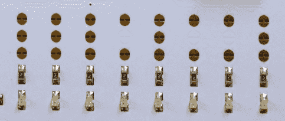

# 防御状态 22:徽章对话

> 原文：<https://hackaday.com/2014/08/08/defcon-22-badge-talk/>

我在主楼层得到了一个很好的座位，参加第一场大的 DEFCON 22 演讲，这是对关于[徽章硬件](https://hackaday.com/2014/08/07/hands-on-defcon-22-badge/)的 CON 和讨论的欢迎。今年徽章的创造者[LosT]以一个关于徽章的玩笑开始了讨论…作为挑战的一部分，隐藏了一个电话号码。[LosT]接到一个追拼图的人的电话。这家伙在观众席上，很有趣。

建立一个可以在 DEFCON 上解决的谜题的过程真的很艰难。你如何让它足够难，不会马上被 pwn，但又足够简单，让很多与会者能够在周末解决它？答案是建立一个安全的系统并引入战略缺陷，这些缺陷将成为参与者解决徽章挑战的攻击媒介。

    

当然徽章可以作为开发平台。板上组装的电子器件都有这些漂亮的小脚印，可以切开这些脚印，将它们与芯片断开。电路板两侧的分线接头允许您连接自己使用的接头。好主意！

挂绳的背面也有特殊的字符。这鼓励了会议中的社区。要解决这个难题，你需要找到其他不同的挂绳。对比字形，破解代码(目前为止我毫无头绪！！).

知道我做错了什么吗？有关于从这里去哪里的建议吗？我会检查评论的！