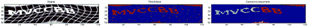

# 击败 Reddit 的验证码

> 原文：<https://hackaday.com/2013/08/11/defeating-reddits-captcha/>

这里有一些我们确信 SEO 专家、公关代表和其他营销人员已经知道的东西:[如何给游戏 reddit](http://iank.org/rmbc.html) 写一个脚本。

赞成票和反对票的过程控制着哪份材料能登上 reddit 的首页。这些提交的内容由用户投票，新账户必须登录并填写验证码才能投票。[Ian]发现 reddit 的验证码并不是最先进的，并想出了如何让一个机器人来解决它

该方法利用了验证码中扭曲网格的 8 位性质。因为这个网格不是纯黑或纯白的，所以它的亮度比验证码中的字母要低。将验证码通过阈值过滤器，删除任何小于 20 像素的像素块，并通过分类器 (PDF 格式)运行[，机器人可以猜测验证码的字母应该是什么。](http://sugiyama-www.cs.titech.ac.jp/~sugi/2010/LSPC.pdf)

在输入到他的算法中的 489 个验证码中，只有 28 个——或 5.73%——被猜对了。然而，因为他知道哪些验证码分割失败，所以忽略这些验证码可以将成功率提高到 10%。理论上，通过请求新的验证码，[Ian]可以让他的验证码机器人的准确率达到 30%左右。

将这个与[一个出色的自动投票脚本](http://hackaday.com/2010/10/08/reddit-hacking-for-votes-and-profit/)结合起来，只需要有人输入验证码，你就可以直接在 reddit 的首页上找到你想要的任何东西。当然，你可以用一些迷因和猫的图片做同样的事情，但是你已经知道了。