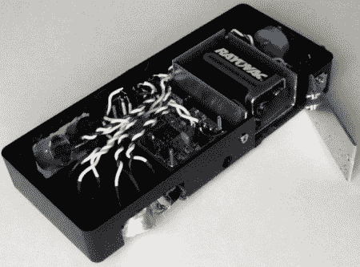

# 防御狗艺术

> 原文：<https://hackaday.com/2012/07/19/defense-against-the-dog-arts/>

可能是[马特·米里安]令人敬畏的双关语赢得了我们，而不是他的[超声波自行车狗防御系统](http://electronicsfluff.blogspot.com/2012/07/defense-against-dog-arts.html)，但那将是愚蠢的。[Matt]想要一个优雅的解决方案来解决骑自行车时的一个常见问题，狗。虽然，淫秽，氨水，胡椒喷雾和其他建议，他们都有缺点，只是没有吸引力[马特]。他喜欢用二氧化碳驱动的高压声波驱赶狗的想法，但决定选择一种更电子化的方法。他使用 Atmel ATmega644 作为 MCU、四个 25kHz 发射机和两个 40kHz 发射机。当骑手看到一只狗时，他只需扳动开关，它就会激活传感器(聪明的是，还有一个人类可以听到的喇叭，所以他不必低头就知道它在工作)。到目前为止[Matt]还没有让一只狗追着他来测试它的功效，但是正如你在休息后看到的，他的猫显然没有受到这个设备的影响。

[https://www.youtube.com/embed/HMNpZvXnm60?version=3&rel=1&showsearch=0&showinfo=1&iv_load_policy=1&fs=1&hl=en-US&autohide=2&wmode=transparent](https://www.youtube.com/embed/HMNpZvXnm60?version=3&rel=1&showsearch=0&showinfo=1&iv_load_policy=1&fs=1&hl=en-US&autohide=2&wmode=transparent)