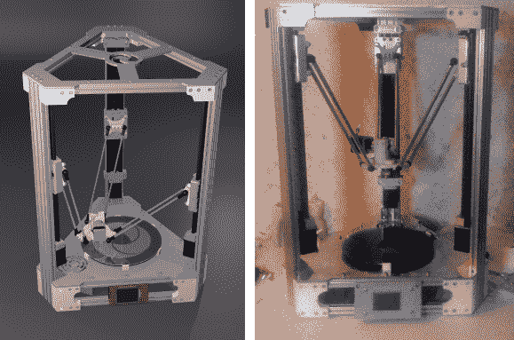

# 使用挤压导轨构建的 Delta 型 3D 打印机

> 原文：<https://hackaday.com/2013/06/02/delta-type-3d-printer-built-using-extruded-rails/>

从概念到完成[这个三角型 3D 打印机](http://3d-printers.pl/ogolne/aluminatus-trident-buildlog/) ( [翻译](http://translate.google.com/translate?hl=en&sl=pl&tl=en&u=http%3A%2F%2F3d-printers.pl%2Fogolne%2Faluminatus-trident-buildlog%2F))是一个甜蜜的构建。作品的质量并不令人惊讶。我们熟悉来自[的【Arkadiusz Spiewak 的】工艺，我们在四月份看到过他的 H-bot 型 3D 打印机](http://hackaday.com/2013/04/05/h-bot-style-3d-printer-moves-bed-for-z-axis/)。

规划从使用 Blender 3D 渲染设计开始。这不仅给他一个 3D 模型作为他的建筑参考，而且动画框架允许他测试设计的运动学。订购了挤压式导轨系统并组装好框架后，他发现由于顶部和底部使用了导轨，柱子弯曲度过大。解决办法是磨一个顶部和底部板，以加强东西。在测试完电机和挤出机机头支架后，他进行了最后一项设计变更。他将他的搅拌机设计导出为 dxf 文件，以切割和焊接挤出机安装平台的铝替代品。正如你在这个视频中看到的，初步结果看起来不错！

[https://www.youtube.com/embed/zsjL_npPxZo?version=3&rel=1&showsearch=0&showinfo=1&iv_load_policy=1&fs=1&hl=en-US&autohide=2&wmode=transparent](https://www.youtube.com/embed/zsjL_npPxZo?version=3&rel=1&showsearch=0&showinfo=1&iv_load_policy=1&fs=1&hl=en-US&autohide=2&wmode=transparent)