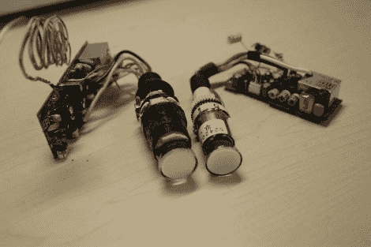

# 揭秘摄像机 CRT 取景器

> 原文：<https://hackaday.com/2012/11/14/demystifying-camcorder-crt-viewfinders/>

如今，每部智能手机(以及大多数智能手机)都内置了摄像头。他们中的一些人甚至能够录制相当不错的高清视频。所以我们敢打赌，你一直在使用的那台几十年前的摄像机再也不会有任何用处了。[John]想鼓励你去黑那个硬件。他发表了一篇文章，展示了抢救和使用摄像机 CRT 是多么容易。

要点是，你只需要接上电源，给它输入视频。连接到 CRT 的电路板有自己的电压硬件来驱动显像管。他演示了 9V 电池作为电源，但也提到从 USB 端口给它供电应该很容易。至于视频，只需要一个复合信号。当然，您必须确定特定 CRT 模块的引脚排列。他选择的方法是使用一个连续性测试仪来寻找从电容器的负极引脚到相应引脚接头的路径。接下来，他使用工作台电源注入限流低电压，直到他在探测引脚时看到响应。找到复合输入是一个类似的试错过程。

那么你能用这个做什么呢？为什么不把它变成一个简单视频游戏的显示屏呢？