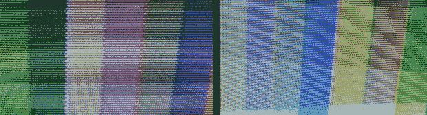

# 揭开 NTSC 彩色和逐行扫描的神秘面纱

> 原文：<https://hackaday.com/2014/07/15/demystifying-ntsc-color-and-progressive-scan/>

黑白 NTSC 很简单——在很长很长一段时间里，它都是用真空管实现的。不过，颜色很奇怪。它以每秒 29.976 帧的速度运行，对不同的颜色使用不同的载波相位，通常需要一段时间才能理解。[Sagar]正在做一个关于 NTSC 复杂性的系列，最新的帖子[涉及彩色和逐行扫描与隔行扫描](http://sagargv.blogspot.in/2014/07/ntsc-demystified-color-demo-with.html)，或者更广为人知的是，经典游戏控制台和家用电脑如何生成视频。

[Sagar]视频实验的测试平台是一个包含 ATMega16、4 位移位寄存器和 14.31818 MHz 时钟的电路。该时钟比 NTSC 载波频率下的 3.579545 MHz 时钟快得多，正好快 4 倍，允许移位寄存器输出载波频率 0，90°的 4 个不同相位。180 和 270。玩电路中 ATMega 上的一些引脚会导致在任何旧电视上生成调色板。

NTSC 要求隔行扫描，即以大约每秒 60 场的速度发送整个偶数行屏幕，然后是整个奇数行屏幕。过去的任天堂和世嘉对此不屑一顾，而是选择以两倍的帧速率发送一半的垂直分辨率。这就是所谓的逐行扫描。[Sagar]发现这导致在现代 LCD 上显示时出现一些图像伪影，返回到隔行扫描模式解决了这个问题。所有代码和文件[都在 gits](https://github.com/s-gv/ntsc-avr) 上。如果你喜欢冒险，这正是像 [Uzebox](http://belogic.com/uzebox/index.asp) 这样的项目如何使用比[Sagar]版本中的 ATMega 多一点的东西来创建家酿游戏机。