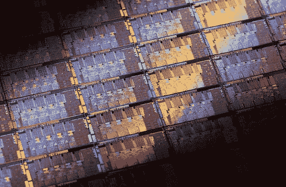

# 用 Verilog 设计你自己的处理器

> 原文：<https://hackaday.com/2014/03/01/design-your-own-processor-with-verilog/>

从头开始设计计算机是硬件设计的神圣目标之一。对于可编程逻辑来说，[设计自己的处理器](https://github.com/zhemao/ez8)是一项巨大的成就。这正是[浙毛]所做的。他创造了 EZ8，一个用 [Verilog](http://en.wikipedia.org/wiki/Verilog) 编写的 8 位处理器。EZ8 有一个 3 级管道，这使得设计非常有趣。[指令集流水线](http://en.wikipedia.org/wiki/Instruction_pipeline)已经在处理器中使用了很多年。它们通过允许处理器并行执行多条指令来加速操作。这个想法类似于洗衣、烘干和折叠衣物。大多数人用管道洗衣服。一件衣物放在洗衣机里，另一件放在烘干机里，第三件正在折叠。然而，管道不是免费的午餐——存在危险。如果一条指令需要一条仍在并行执行的指令的结果，那就有问题了。在我们的洗衣类比中，这就像一只袜子放在折叠桌上，而它的另一只还在烘干机里。在袜子可以配对之前，折叠操作必须等待干燥操作完成。这正是装配工处理这种情况的方式——他们在已知的危险指令之间插入 nop。

[zhemao]不只是给我们一个处理器，但没有支持。他还包括一个用 OCaml 编写的汇编程序和一个用 c 语言编写的仿真器。几个测试汇编程序也在[【哲猫的】github repo](https://github.com/zhemao/ez8) 上运行，以验证操作。[zhemao]已经用 [Altera Cyclone 5](http://www.altera.com/devices/fpga/cyclone-v-fpgas/cyv-index.jsp) 系列[FPGA](http://en.wikipedia.org/wiki/Fpga)测试了他的处理器，但是应该可以移植到其他 FPGA 厂商。如果你想了解更多信息，【哲猫】在 [ECE 子版块](http://www.reddit.com/r/ECE/comments/1yqrjr/toy_8bit_soft_microcontroller_implemented_in/)也有讨论。

【感谢 LongHornEngineer 的提示！]

[图片由[英特尔](http://www.flickr.com/photos/intelfreepress/8660652107/sizes/o/in/photostream/)提供]