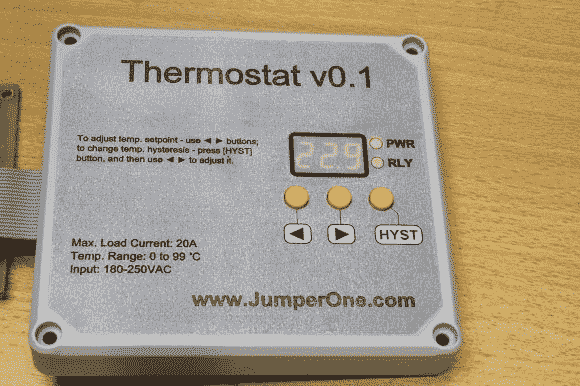

# 为 DIY 项目设计前面板

> 原文：<https://hackaday.com/2014/04/08/designing-a-front-panel-for-a-diy-project/>

当建立一个一次性的 DIY 项目时，外观往往是我们最不重视的。我们只是想让设备工作起来，然后塞进一些工程案例中。对于那些喜欢建造更好看的原型的人，[JumperOne]想出了一个巧妙的方法，为你的 DIY 项目建造一个定制的前面板。

第一步是获得正确的尺寸。您的 CAD 工具将从您的设计中生成这些。[JumperOne]将这些测量数据放入开源矢量图形工具 [Inkscape](http://inkscape.org/) 中。一旦进入 Inkscape，就可以围绕控件设计面板。这将被打印出来，并在塑料外壳上对齐，这样就可以标记和钻孔。

电子设备就位后，前面板再次印刷在通用粘合片上。接下来是一块冷覆膜，保护标签。最后，为控制装置打孔。请注意，显示屏和 led 被覆盖，这使得薄膜能够漫射光线。最终的结果看起来不错，可以直接在面板上提供所有需要的说明。

[感谢 Ryan 的提示]