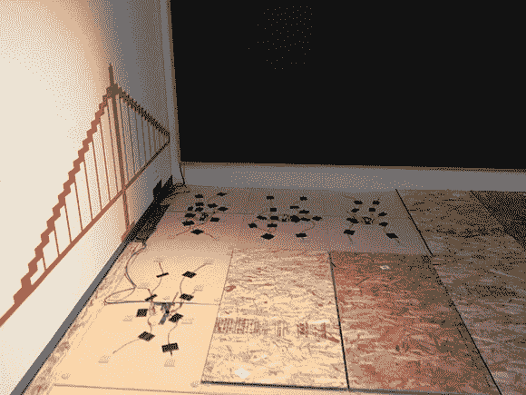

# 设计压敏地板

> 原文：<https://hackaday.com/2013/08/13/designing-a-pressure-sensitive-floor/>

[Sean]和他在 Adobe 的团队被要求为旧金山的儿童创意博物馆建造“一些新东西”，所以在几个月内，他们设法为孩子们建造了一个名为“Sense It”的数字/物理环境。

这个项目的一部分包括设计和建造一个压敏电子地板，它可以检测孩子们是坐着、走着还是跑着。由于基于摄像头的检测系统无法提供他们想要的精度，[Sean]决定使用放置在 MDF 面板下的压敏电阻。

总共有 21 个 2'x4 '瓦片，每个瓦片包括 8 个压敏电阻和一个基于 ATtiny84 的平台。所有的微控制器都将其 8 个传感器信号数字化，并通过 RJ45 CAT5 电缆中的共享 i2c 总线将其转换结果发送到 beaglebone。因为这是[Sean]的第一个项目，我们会放他一马，但我们认为有几个设计错误:

*   用 i2c 代替 RS485 / CAN 进行远距离数据传输
*   将远离传感器的电压数字化，因为在 ADC 之前会添加噪声
*   在 RJ45 电缆中发送 ATtiny 所需的+5V 电压，而不是更高的电压(这将涉及在平台上放置一个 LDO)
*   将数字和模拟接地层分开，因为平台电流消耗低，传输速度慢

但是现在能玩完整系统的孩子肯定不会在意。你……你觉得[肖恩]的工作怎么样？请不要犹豫，在下面的评论区告诉我们。