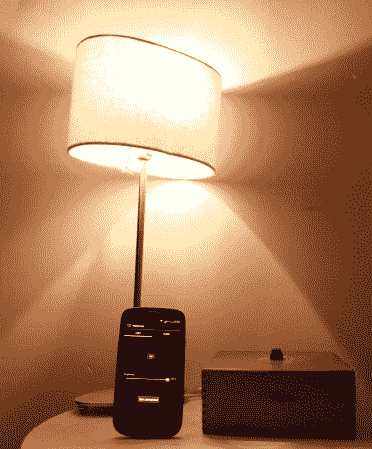

# 设计唤醒灯

> 原文：<https://hackaday.com/2014/03/27/designing-a-wakeup-light/>

 【阿克希尔】和他的妻子最近完成了[他们的唤醒之光项目](http://beagaroo.wordpress.com/2014/03/19/wakeup-light-design/)。顾名思义，这种早晨闹钟是利用光线在早上叫醒你的。开始这种加强关系的冒险时，主要的限制是成本、使用任何台灯的能力，以及拥有简单而有效的控制界面，同时保持所有设计的开放性。创建的平台(放在上面显示的木箱中)围绕 Stellaris Launchpad(基于 ARM Cortex M4)构建，并使用本指南[中的交流调光电路](http://www.instructables.com/id/Arduino-controlled-light-dimmer-The-circuit/)。对于我们对此感兴趣的读者，[Akhil]在这里和这里提到了两篇非常有趣的关于他们操作理论的文章。

一个 Android 应用程序被用来设置所有的警报参数，它使用手机的蓝牙与连接到 Launchpad 的(众所周知的)HC-05 蓝牙收发器进行通信。为了安全起见，当前设计还包括一个基于 LM4876 的音频放大器，连接到微控制器的 PWM 输出。下一个版本将集成一个数模转换器和一个 SD 卡插槽，以获得更好的质量和音乐多样性。休息之后嵌入了演示视频，你可以在 GitHub 找到[官方知识库。](https://github.com/AkhilPiplani/WakeUpLight/)

[https://www.youtube.com/embed/OUPcwDod-dM?version=3&rel=1&showsearch=0&showinfo=1&iv_load_policy=1&fs=1&hl=en-US&autohide=2&wmode=transparent](https://www.youtube.com/embed/OUPcwDod-dM?version=3&rel=1&showsearch=0&showinfo=1&iv_load_policy=1&fs=1&hl=en-US&autohide=2&wmode=transparent)