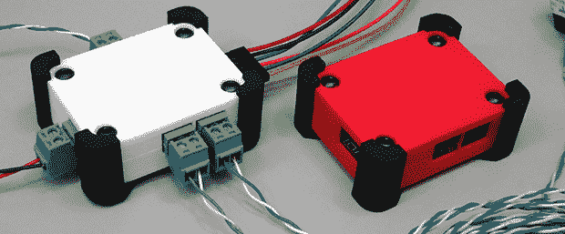

# 设计和打印自定义附件

> 原文：<https://hackaday.com/2014/06/05/designing-and-printing-a-custom-enclosure/>

因此，你知道如何设计电路板，组装零件，并在焊接结束时拥有一个功能器件。很好，但如果你想在现实世界中使用这种设备，你可能会想要一个外壳，特百惠用 Exacto 刀砍是不会切断它的。为您的主板设计一个定制的外壳实际上并不难，正如[【Glen】用一个定制的 3D 打印项目盒](http://bikerglen.com/blog/building-an-enclosure-using-sketchup-and-3d-printing/)所展示的那样。

[Glen]的电路板是一个带 PMOD 连接器的四通道 RS-422 发射器，由 Eagle 设计。这种机械设计工作有大量的脚本和插件，包括将 Eagle PCB 转化为可以导入 SketchUp 的 3D 对象的 [EagleUP 插件](http://eagleup.wordpress.com/)。

根据 Eagle 的测量结果，[Glen]设计了一个适合 PCB 的小型项目箱。添加了一些支架，并且将板本身导入到 SketchUp 中。从那里，他需要做的只是从外壳的壁上减去连接器的轮廓，以定制外壳。比特百惠好得多，也比设计激光切割外壳容易得多。

一旦外壳完成，[Glen]将设计导出为 STL，准备进行 3D 打印，或者在他的情况下，发送到 Shapeways。无论哪种方式，结果都是一个完美的定制外壳。