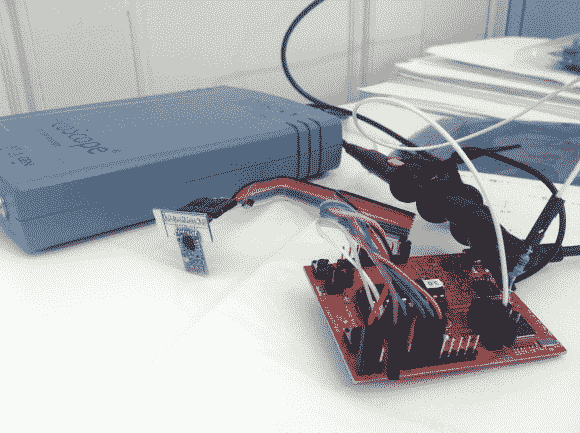

# Contiki 的简单无线电占空比协议的设计、模拟和测试

> 原文：<https://hackaday.com/2014/01/09/designing-simulating-and-testing-a-simple-radio-duty-cycling-protocol-for-contiki/>

几天前，我们将[Marcus]'[Contiki 移植到 TI launch pad](http://hackaday.com/2014/01/07/porting-contiki-to-the-ti-msp430-launchpad/)，[Contiki](http://www.contiki-os.org/)是一个致力于物联网的开源操作系统，由瑞典 SICS 的[Adam Dunkels]创建。[Marcus]的部分工作包括设计一个简单的[无线电占空比协议](http://www.bithappens.se/blog/2013/05/26/simple-yet-efficient-wireless-with-contiki/)，它实现了 3%的空闲侦听占空比，同时允许平均 65 毫秒的延迟，而无需事先联系或同步。

一些读者可能已经知道，无线设备监听/发送数据需要相当大的功率。因此，平台需要一种算法，在允许(定期)计划数据传输的同时，将功耗降至最低。在创建了名为 SimpleRDC 的协议后，[Marcus]首先使用 Cooja 模拟器对其进行了模拟，以检查它是否能按预期执行。然后，他实施了一项实际测试，通过嗅探连接 MSP430 和无线模块的 SPI 线路，并使用示波器和分流电阻监控平台功耗，来检查协议的性能。