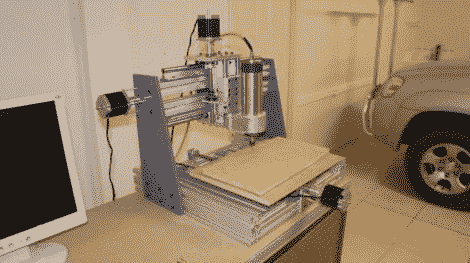

# 作为高中项目建造的桌面磨坊

> 原文：<https://hackaday.com/2012/10/10/desktop-mill-built-as-a-high-school-project/>

任何人都会对这个台式研磨机印象深刻，但我们真的很兴奋它是作为一个高中项目制作的。[普拉内特·纳拉扬]在他的设计和技术课上建造了它。[正如他的建造日志所显示的](http://forums.overclockers.com.au/showthread.php?t=1029793)，他使用了一系列不同的工具来确保他有一个坚固的平台来安装电机和切割头。

框架的立柱由两块钢板制成。在用等离子切割机将它们切割成粗糙的形状后，他用磨将边缘打磨光滑。然后将两个零件点焊在一起，这样安装孔可以一步钻好，确保两侧对齐。框架的其余部分是由挤压成型的轨道制成的，但他确实加工了一套安装板来将它们组装在一起。你可以看到成品机在剪辑后的 MDF 中铣出一条信息。

[https://www.youtube.com/embed/0nBRoq7GnJo?version=3&rel=1&showsearch=0&showinfo=1&iv_load_policy=1&fs=1&hl=en-US&autohide=2&wmode=transparent](https://www.youtube.com/embed/0nBRoq7GnJo?version=3&rel=1&showsearch=0&showinfo=1&iv_load_policy=1&fs=1&hl=en-US&autohide=2&wmode=transparent)

[谢谢凯文]