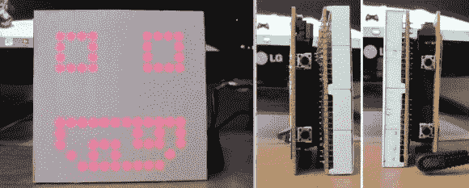

# 桌面大小的电子鸡更难以忽视

> 原文：<https://hackaday.com/2014/04/13/desktop-sized-tamagotchi-is-even-harder-to-ignore/>

[Vadim]有一天觉得工作有点无聊，于是想出了这个相当奇怪的项目。他手边有一个备用的 LED 矩阵，他想，“我应该做一个巨大的电子鸡……”[于是他做了。](http://www.instructables.com/id/Make-a-Desktop-Tamagotchi/)

如果你没有意识到，电子鸡是在 90 年代末引入的电子宠物。你必须喂养它们，和它们玩耍，甚至训练它们——试图教会拥有一只真正的宠物的责任。这是一种时尚，老实说，它们真的很讨厌——但这并没有阻止[Vadim]想要自己制作！

他在这个项目中使用了一台 ATmega328P 和 Arduino 引导加载程序。LED 矩阵由一组四个 8×8 LED 模块组成，带有四个移位寄存器(74HC595)和两个达林顿晶体管阵列来接收电流，这是因为 256 个 LED 需要多路复用为 32 个 IO(16 行+ 16 列)。

一旦硬件全部完成，他就开始编码——他实际上从头开始编码了整个游戏，虽然它并不复杂，但在这个桌面大小的电子鸡上仍然付出了令人印象深刻的努力！

为了看到它的实际效果，请在休息后留下来。

[https://www.youtube.com/embed/Zx2ADi0KUig?version=3&rel=1&showsearch=0&showinfo=1&iv_load_policy=1&fs=1&hl=en-US&autohide=2&wmode=transparent](https://www.youtube.com/embed/Zx2ADi0KUig?version=3&rel=1&showsearch=0&showinfo=1&iv_load_policy=1&fs=1&hl=en-US&autohide=2&wmode=transparent)

要了解更多关于破解电子鸡的信息，有一个关于如何对它进行逆向工程的精彩演讲，我们几年前已经讨论过了。