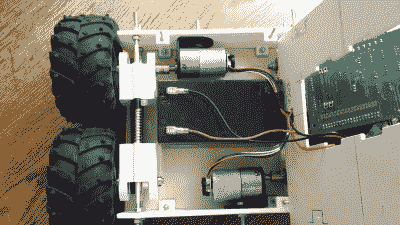

# 令人惊讶的详细机器人地面车辆指南

> 原文：<https://hackaday.com/2015/07/01/detailed-robotics-ground-vehicle-design-guide/>

[Andrey Nechypurenko]已经编写了一份出色的设计指南，描述了他的 a20 grou1nd 车辆的开发，并且正在[开源所有的原理图和源代码。](https://github.com/veter-team/a20)

【安德烈】以前的[设计之一](http://hackaday.com/2011/11/14/theres-a-lot-packed-into-this-beagleboard-controlled-rover/)使用了 Pololu 履带式底盘。但这次他从头开始设计一切。在他关于 a20 的第一篇文章中，[Andrey]描述了车辆的机械设计。特别是关注不同驱动系统、电机类型和底盘构造方法之间的权衡。他还讲述了使用开源设计工具(FreeCAD)的挑战，以及他面临的其他实际挑战。他详尽的文档为未来的黑客提供了宝贵的参考。

[Andrey]渴望带着这个系统兜一圈，所以他很快在平台上黑了一个电机控制器和无线电接收器(查看下面的视频)。a20s 最终大脑将是一个覆盆子 Pi，我们期待着[Andrey]关于软件和电子控制系统的更多帖子。

 [https://www.youtube.com/embed/W47cyLSvp90?version=3&rel=1&showsearch=0&showinfo=1&iv_load_policy=1&fs=1&hl=en-US&autohide=2&wmode=transparent](https://www.youtube.com/embed/W47cyLSvp90?version=3&rel=1&showsearch=0&showinfo=1&iv_load_policy=1&fs=1&hl=en-US&autohide=2&wmode=transparent)