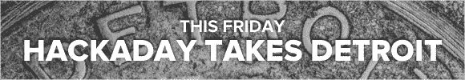

# 本周五底特律聚会

> 原文：<https://hackaday.com/2014/07/07/detroit-meetup-this-friday/>

计划制定好了，赃物已经运出了，你会出现吗？周五晚上 8 点，我们将在底特律 i3 召开一个非正式聚会。这个链接就是你获得免费机票的途径。

你可以来黑客攻击，休闲时间，或者只是为了获得一件免费的衬衫和足够的贴纸，以避免实际上重新油漆你称为汽车的 1991 POS。

i3 为那些想参与项目或只是闲逛的人提供他们的设施。他们与 [B 游泳者](http://www.bnektar.com/)共用一个屋顶，所以有一系列美味的饮料可供选择(这也是我们称之为 18 岁以上活动的部分原因)。甚至有人说今晚可以在外面停一辆食品车，但是他们还在努力。

带一些硬件来炫耀，看看你是否能跟上[Brian Benchoff]、[Chris Gammell]和[Mike Szczys]众所周知的故事。