# 在黑客日开发的:设计

> 原文：<https://hackaday.com/2014/01/20/developed-on-hackaday-the-designs/>

[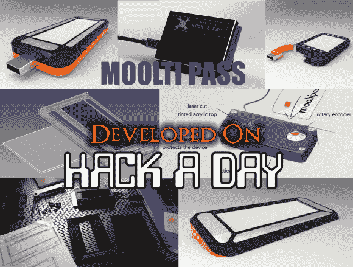](http://hackaday.com/wp-content/uploads/2014/01/designs.png)

我们知道，我们的许多读者已经不耐烦地等待着发现 Hackaday 社区开发的离线密码管理员项目将会是什么样子。今天，我们向您展示几个由我们的机械贡献者提出的设计，我们将询问您对它们的看法。显然，这些只是初步案例，可能会不断发展，但我们将只为您喜欢的设计生产电子产品。

所有的设计都在休息后嵌入，通过多项选择投票来表达你的兴趣。如果你想更深入地讨论这些设计或者见见它们的创造者，你可能也想加入谷歌的 Mooltipass 组。在固件方面，我刚刚完成了许多 mooltipass 原型的焊接，这些原型将在未来几天内发送给我们的固件开发人员。你可能已经注意到了，这个项目正在加速！

**【路易】'设计一:**

[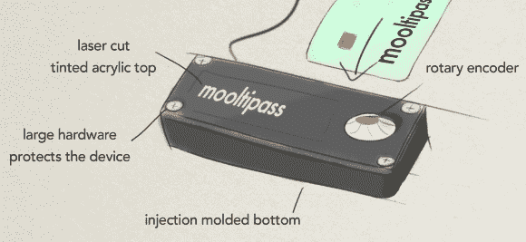](http://hackaday.com/wp-content/uploads/2014/01/louis_design.jpg)

这种设计围绕着一个注塑成型的底部和一个有色丙烯酸顶部，这将是激光切割。这两个部分将使用进入(或穿过)底部的丙烯酸顶板顶部的大螺栓固定在一起。大型五金件也可能会突出一点，并可能有助于保护丙烯酸顶部免受刮擦。[Louis]感觉大型硬件使它看起来坚固和安全。丙烯酸顶板可以让用户看到设备内部，也可以保护屏幕。由于屏幕顶部的丙烯酸树脂，我们不得不依赖触摸屏以外的东西来进行用户输入，在这种情况下，是旋转编码器。这种设计会模仿保险箱的感觉。使用金属挤压件作为设备的主体会很好，但需要加工以适应卡槽和 USB 电缆，导致更高的外壳成本。这是一张 3D 渲染图:

[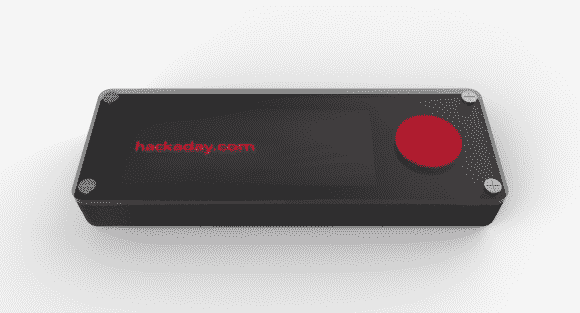](http://hackaday.com/wp-content/uploads/2014/01/injection-lasercut-rotary.jpg)

**【路易】的设计二:**

[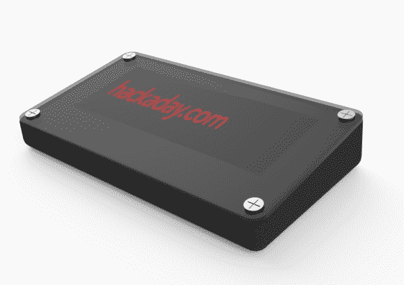](http://hackaday.com/wp-content/uploads/2014/01/injection-lasercut-capsense.jpg)

类似的设计，他以前的一个，仍然使用一个半透明的顶部注塑成型的基础。只是这一次，它的整体尺寸小了一点，但也大了一点，以容纳屏幕下方的电容传感器条。这款手机还像桌面键盘一样有一点倾斜角度，便于查看屏幕和与设备互动。与以前的设计一样，USB 电缆和智能卡将插在后面。

**【路易】的设计三:**

[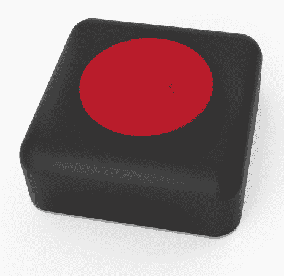](http://hackaday.com/wp-content/uploads/2014/01/injection-lasercut-noscreen.jpg)

这里有一个更奇怪的。如果设备严重依赖于浏览器扩展，则可以在不使用设备屏幕的情况下操作它。在这种情况下，主体将是注射成型塑料，底部将是半透明的激光切割丙烯酸。这将允许你隐约看到设备内部，以确保没有任何东西被篡改。它还可以让明亮的 RGB led 使设备的底部发光。[Louis]可以想象，浏览器扩展可以请求输入密码，然后底部会亮起红色，您有 3 秒钟的时间按下按钮进行身份验证，然后它会淡出绿色，让您知道它工作正常。[Louis]真的不确定这有多可行，但他还是提出来了…

**【乔】的设计 1 :**

[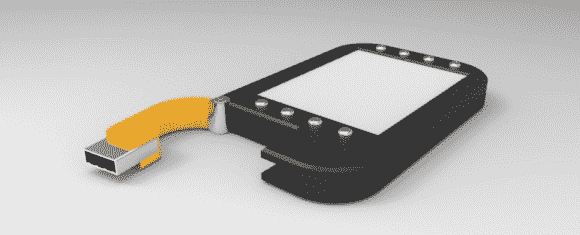](http://hackaday.com/wp-content/uploads/2014/01/joe_design_11.jpg)

这个想法是，铰链 USB 插头也可以用来将这种设计固定到包或钥匙链上。但是[乔]承认这可能超出了预算。

**【乔】的设计二:**

[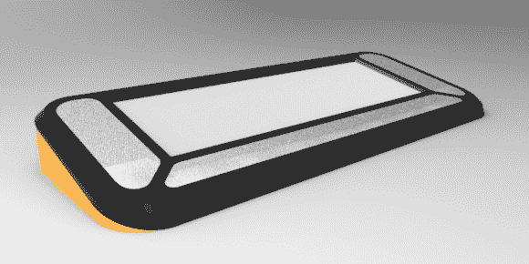](http://hackaday.com/wp-content/uploads/2014/01/joe_design_21.jpg)

[Joe]的印象是，我们很难在预算内实现触摸屏，因此按钮和/或电容传感器可能是更便宜的替代方案。在屏幕附近放置按钮或电容感应将允许 UI 在屏幕边缘显示按钮的功能。因此，根据上下文，按钮可以具有不同的功能。至关重要的是，如果按钮这么大，用户将能够触摸电容带的不同部分来输入由数字 0-9 组成的代码。如果电容式触摸传感器可以构成 PCB 的一部分，[Joe]认为这将是实现用户输入的一种非常廉价的方式。

**【乔】的设计三:**

[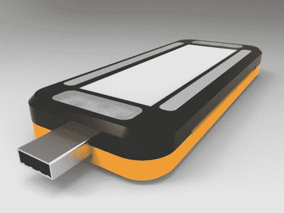](http://hackaday.com/wp-content/uploads/2014/01/joe_design_3.jpg)

你可能已经猜到，这种设计在顶部/底部有电容触摸滑块，在左侧/右侧有电容按钮。有人表示担心，当设备插入笔记本电脑时，使用 USB 连接器可能不安全。

**【安迪】的设计:**

[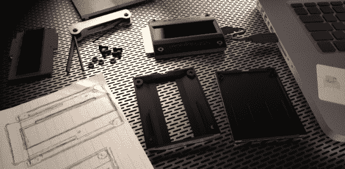](http://hackaday.com/wp-content/uploads/2014/01/andy_design.png)

这种设计旨在成为一种只有触摸屏的设备，但可以修改为电容输入，滑块位于显示器的任一侧(顶部/底部)。[安迪]喜欢这个设计的一点是水平对称轴。对于笔记本电脑用户来说，该设备可以在任何一侧使用，只需一根短的 usb 电缆直接连接到端口。显示将在软件中翻转。

**【乔希】的** **设计:**

**[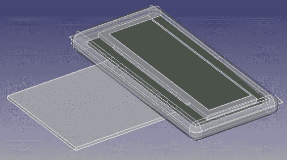](http://hackaday.com/wp-content/uploads/2014/01/josh_design.png)**

[Josh]没有机会画出来的两个东西是:一个短边上的 USB 端口和触盖区域。一对辅助 PCB 可以沿着屏幕的左侧提供 4 个 cap-touch 按钮，并且沿着右侧提供一个“滑块”区域。

**【奥利维尔】的设计** **:**

**[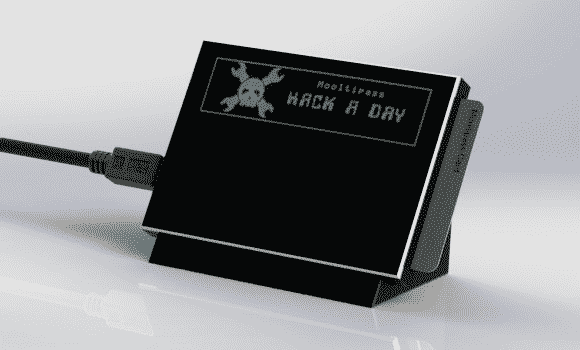](http://hackaday.com/wp-content/uploads/2014/01/olivier_design.jpg)**

这是一个由两部分组成的触摸式设计:一个底座和一个信用卡大小的盒子。磁体将被包含在底座中，以防止多通道机器人移动。

那么，我们亲爱的 Hackaday 读者是怎么想的呢？请在下面为你最喜欢的设计投票！如果你订阅了 [Mooltipass Google Group](https://groups.google.com/forum/?hl=en#!forum/mooltipass) ，你可能想让电子邮件通知保持更新……有一场很棒的讨论正在进行，我们正在努力确定最终固件应该使用的许可证。