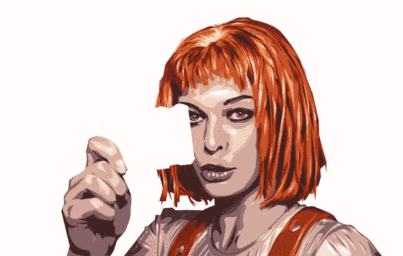
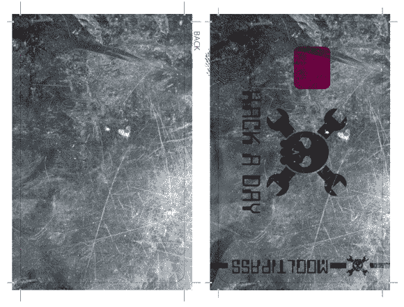

# 在 Hackaday 上开发:为你最喜欢的卡片艺术投票

> 原文：<https://hackaday.com/2014/04/21/developed-on-hackaday-vote-for-your-favorite-card-art/>

[几周前](http://hackaday.com/2014/03/27/developed-on-hackaday-need-card-art-who-likes-to-draw/)我们问我们亲爱的读者，他们是否有兴趣为 [Mooltipass 项目](https://github.com/limpkin/mooltipass)创作一些卡片艺术。我们收到了[十几封](https://github.com/limpkin/mooltipass/tree/master/smartcard_designs)的邮件，几天前[的项目 Mooltipas](http://hackaday.io/project/86-Mooltipass)关注者/ [Mooltipas Google group](https://groups.google.com/forum/#!forum/mooltipass) 收件人投票选出了他们最喜欢的邮件。

今天我们将为您呈现三个受欢迎的，并要求您选择您最喜欢的，所以请在休息后跟随我们…

[![[Bjorn]'s design](img/5cbb0f0b6004c10d1f8f4c2658cddb29.png)](http://hackaday.com/wp-content/uploads/2014/04/z_bjorn-wielens_suggested_design_v32.png)

[Bjorn]是一个非常积极务实的 Google group 参与者，所以这是他发给我们的设计。假设智能卡正好有 1.2 厘米从 Mooltipass 外壳中伸出，那么一旦插入智能卡，您将只能看到“Mooltipass key card”文本。

 【卢克】是做事情的人。上面显示的设计在我们之前的调查中非常受欢迎。

[![[Robert]'s design](img/72adec61850254c8773a8d3d5bd6365a.png)](http://hackaday.com/wp-content/uploads/2014/04/z_robert-tomsons_suggested_design_v11.png) 我们的德国投稿人【Robert】给了我们一个更严肃的黑白设计，在我们看来确实很好看。

你们觉得怎么样？您可以为您最喜欢的设计投票和/或在下面提交您的评论。

[文章图片属性: [angelitomercenario](http://www.angelitomercenario.blogspot.ch/) ]