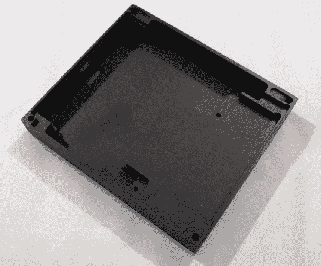

# 在 Hackaday 上开发:我们有最终的原型！

> 原文：<https://hackaday.com/2014/06/05/developed-on-hackaday-we-have-final-prototypes/>

过去的几周对于 Mooltipass 团队来说相当紧张，因为我们不耐烦地等待我们的[智能卡](http://hackaday.com/2014/04/21/developed-on-hackaday-vote-for-your-favorite-card-art/)、[外壳](http://hackaday.com/2014/04/15/developed-on-hackaday-oliviers-design-rundown/)和[前面板](http://hackaday.com/2014/05/27/developed-on-hackaday-front-panels-and-beta-testers-program/)从生产中回来。今天我们收到了一个来自中国的包裹，所以我们知道这是真相大白的时刻。如果你有很好的网络连接，并且想看更多的最终产品的图片，请在休息后关注我们…

我们以前从未在 Hackaday 上提到过这一点，但我们实际上制作了两个不同版本的 Olivier 案例:一个薄的和一个厚的。超薄型与 Arduino 不兼容，仅面向我们亲爱的贡献者，因为它由铝制成，因此非常昂贵:

厚实的 Arduino 兼容外壳仅厚 1.9mm(13.9mm 而非 12mm)，材质为黑色 ABS。您可以注意到连接器凹槽:

你可能已经猜到，所有的原型都是数控加工，然后阳极氧化或油漆。很明显，我们将寻求更大数量的注塑外壳，这将是我们未来几个月的主要挑战之一…

当我们看到我们的 PCB 可以紧密地放入箱子中时，我们松了一口气，特别是考虑到其中有几块是生产出来并运送给我们在世界各地的捐助者的:

在我们上一篇关于 Hackaday 系列的文章中，我们声明我们已经决定将透明的前面板换成有色的。我们刚刚收到的新电脑与我们组装的原型完美契合，当屏幕关闭时，它会呈现出干净专业的外观:

请放心，即使顶部有 1 毫米厚的丙烯酸面板，我们的电容式触摸界面也表现得非常好。我们在顶部 PCB 和面板之间使用 0.11 毫米厚的双面胶带，以保持良好的接触。

最后，我们还收到了我们亲爱的 Hackaday 读者选择的智能卡。不幸的是，它们印错了方向，留下了错误的部分。

那么 Mooltipass 项目的下一步是什么？

现在，我们知道我们的硬件是最终的，我们将选择测试版测试人员，并有一个小的 Mooltipass 生产运行运送给他们。与此同时，我们的贡献者将努力工作，希望在几个月后，我们可以开始我们的众筹活动！

想要保持消息灵通？你可以加入官方的 [Mooltipass Google Group](https://groups.google.com/forum/?hl=en#!forum/mooltipass) 或者关注我们的[黑客项目](http://hackaday.io/project/86-Mooltipass)。