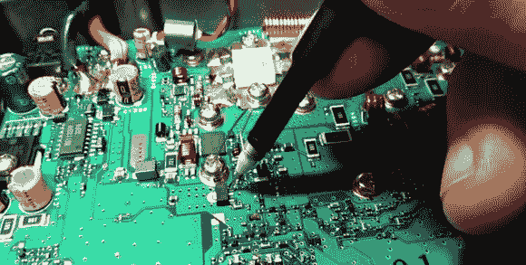

# 诊断和修理八重洲 FT-7800 业余无线电

> 原文：<https://hackaday.com/2013/11/11/diagnose-and-repair-a-yaesu-ft-7800-ham-radio/>

[Alan Wolke]又名[w2ew]被挑战去修理一个朋友的八重洲 FT-7800 火腿收音机。这台收音机工作在两个汉姆波段，2 米甚高频和 70 厘米超高频。投诉是 2 米的一边不工作，但 70 厘米传输罚款。Alan 首先使用一个带有 50 W 芯片的 Bird 瓦特计来验证投诉，并将信号端接至 50w 假负载。[Allen 的] bird meter 是一种配有 RF 采样器的类型，该采样器可以连接到示波器，以增加信号观察和验证。

在确认无线电不像描述的那样工作后，Alan 开始扫视电路板，寻找任何明显的损坏。然后，他带我们看了 FT-7800 无线电的框图和电路图，然后带我们看了无线电维修的故障排除和诊断。即使当他意识到他可能已经找到了问题所在，他仍然会一步一步地带领我们完成诊断的剩余部分。Alan 分享的技能和知识对任何想修理收音机的人来说都是非常有价值的。

剧透警报。在第一个视频的结尾，他确定靠近最终 VHF 输出的 pin 二极管是坏的。在第二段视频中，他透露他不再能找到这些不良组件。通过对一台更现代的八重洲收音机的巧妙评估，[艾伦]找到了合适的替换组件。第二课以一些表面贴装焊接返工技巧以及测试修复是否成功结束。

如果你不知道 pin 二极管是什么，或者有什么用途，Alan 分享了第三段视频,讲述了这个元件在无线电中的作用。可以跟着跳转看全部三个视频。

[https://www.youtube.com/embed/Cz_OcsqZXn4?version=3&rel=1&showsearch=0&showinfo=1&iv_load_policy=1&fs=1&hl=en-US&autohide=2&wmode=transparent](https://www.youtube.com/embed/Cz_OcsqZXn4?version=3&rel=1&showsearch=0&showinfo=1&iv_load_policy=1&fs=1&hl=en-US&autohide=2&wmode=transparent)
[https://www.youtube.com/embed/mAhvvoBuSRs?version=3&rel=1&showsearch=0&showinfo=1&iv_load_policy=1&fs=1&hl=en-US&autohide=2&wmode=transparent](https://www.youtube.com/embed/mAhvvoBuSRs?version=3&rel=1&showsearch=0&showinfo=1&iv_load_policy=1&fs=1&hl=en-US&autohide=2&wmode=transparent)
[https://www.youtube.com/embed/XpYsCM_Wf50?version=3&rel=1&showsearch=0&showinfo=1&iv_load_policy=1&fs=1&hl=en-US&autohide=2&wmode=transparent](https://www.youtube.com/embed/XpYsCM_Wf50?version=3&rel=1&showsearch=0&showinfo=1&iv_load_policy=1&fs=1&hl=en-US&autohide=2&wmode=transparent)