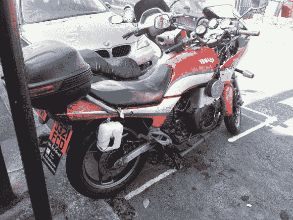

# 柴油自行车制造:第 2 轮

> 原文：<https://hackaday.com/2013/09/04/diesel-bike-build-round-2/>

[亚历克斯]一直在努力研制他的第二辆植物油驱动的柴油自行车。上次我们登记时，他正在完成他的本田 CB400 在[的工作。不幸的是，他觉得它不够大，骑起来不舒服，而且像大多数第一次建造的车一样，它也有很多问题。现在，他在易贝偷了一辆雅马哈 XJ600，清理干净后开始改装。[亚历克斯]延长了框架，以适应新的引擎，重建了变速箱，也许最令人生畏的是:用一台 1950 年的老式车床车削滑轮。](http://hackaday.com/2012/03/26/bodging-up-a-diesel-motorcycle/)

现在[亚历克斯的]自行车已经通过了[MOT 检查](http://en.wikipedia.org/wiki/MOT_test)，他可以享受四处巡游，同时尽自己的一份力量来保护环境。他的构建日志详细描述了这一过程，并配有足够多的图片，足以让你忙上几个小时，同时它会带你完成每一步。你可以在下面观看自行车的试车视频。对于你的越野类型，看看上个月的[全轮驱动摩托车](http://hackaday.com/2013/08/12/all-wheel-drive-motorcycle/ "All wheel drive motorcycle")。

[https://www.youtube.com/embed/iB7VA9AkrTg?version=3&rel=1&showsearch=0&showinfo=1&iv_load_policy=1&fs=1&hl=en-US&autohide=2&wmode=transparent](https://www.youtube.com/embed/iB7VA9AkrTg?version=3&rel=1&showsearch=0&showinfo=1&iv_load_policy=1&fs=1&hl=en-US&autohide=2&wmode=transparent)