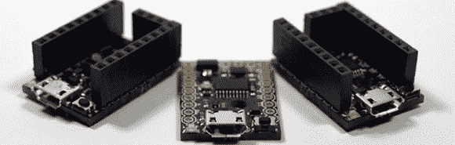

# Digispark Pro，更大更小的开发板

> 原文：<https://hackaday.com/2014/04/23/digispark-pro-the-bigger-smaller-dev-board/>

最近出现了大量基于 ATtiny85 的极小型开发板。这种小型 8 引脚微控制器能够运行大多数 Arduino 草图，这些开发板的小尺寸和低价格意味着它们非常受欢迎。Digispark 是第一批这种小型主板，现在这位创造者正在发布一个更新、更大的版本[，名为 Digispark Pro](https://www.kickstarter.com/projects/digistump/digispark-pro-tiny-arduino-ready-mobile-and-usb-de/) 。

新的主板不是基于 tiny85，而是基于 ATtiny167。这款更大的 20 引脚芯片增加了 10 个 I/O 引脚和一个真正的硬件 SPI 接口，但最好的功能来自 Digispark Pro 封装。这次有真正的 USB 编程、设备仿真和 USB 上的串行，以及使用 Arduino 串行监视器的能力，这是最初的 Digispark 所没有的。

这一次也有更多的盾牌，WiFi 和蓝牙盾牌作为额外的奖励。没有防护罩，Digi Pro 很便宜，每块主板只比原来的 Digispark 贵 2 美元。