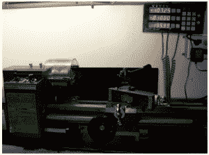

# 为 DRO 项目牺牲的数字卡尺

> 原文：<https://hackaday.com/2014/09/25/digital-caliper-sacrificed-for-dro-project/>

一般来说，在车床或铣床上加工金属需要技巧和耐心，因为切割的精度很重要。为了进行精确的切割，了解刀具的位置和移动距离是很重要的。对于手动机器，确定位置的最基本方法是使用安装在手动曲柄上的刻度盘。虽然这些刻度刻度盘肯定是准确的，但是它们可能很难看到，并且它们还需要操作者在刻度盘的每一次完整旋转中在他们的头脑中进行计算。另一种选择是数字读数(DRO)，它有一个安装在机器移动轴上的编码器。该设置在易于阅读的数字显示屏上显示刀具的准确位置。

用于铣床和车床的专业 DRO 套件的价格从几百美元到几千美元不等。[Robert]有一台车床，想要一台 DRO，但不想花大价钱购买。他以极其足智多谋的方式，以超低的价格建造了自己的 T1。使用港口货运数字卡尺。首先制造一个外壳，以便增加的设备不会妨碍车床的轴行程。然后将卡钳切割成一定长度，安装在外壳中，然后将整个组件安装到车床上。

使用标准卡尺显示器读取位置信息是完全合理的，然而，即使是这些廉价的数字卡尺也有用于编码器输出数据的[连接，可以很容易地被微控制器读取。这意味着将这些低成本的数字卡尺挂在一个更方便的远程显示器上非常简单。](http://hackaday.com/2010/12/15/reading-a-digital-caliper-with-a-microcontroller/)