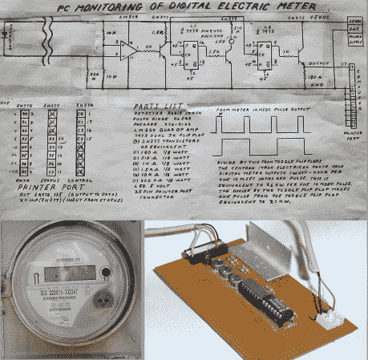
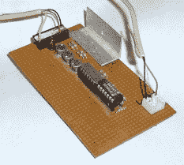
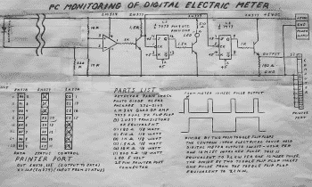

# 数字电表监控器过时了

> 原文：<https://hackaday.com/2013/12/14/digital-electric-meter-monitor-goes-old-school/>

**

[Sal]给我们发了他的数字电表监控器，这立刻让我们怀念起了一些 [Forrest Mims 的书](http://www.amazon.com/Getting-Started-Electronics-Forrest-Mims/dp/0945053282/)。Sal 的原理图和电路描述类似于 Forrest 的风格，我们认为这是一种恭维。即使在当今的 CAD 和 EDS 软件包世界里，手工绘制电路草图有时也更容易、更快。示意图并不是[萨尔]设计的唯一经典方面。他正在一台未使用过的个人电脑上使用并行端口收集数据:在这种情况下，是一台运行 Windows 95 的东芝 Libretto。在廉价的基于闪存的微控制器和开发板出现之前，PC 并行端口是我们许多人的首选硬件接口。运行这些老软件的许多软件都是用 basic 语言编写的，Sal 的 meter 也不例外。他的软件运行在 T2 的微软 QBasic T3 上，该软件随 Windows 95 一起发布。

该电路利用了数字电表的输出:每消耗 1 瓦时的电能，就会产生一个 10 毫秒的脉冲。RadioShack 的红外光电检测器检测电表脉冲，并由 LM324 运算放大器放大。然后，一个 NPN 晶体管转换输出，将其发送到两个 74LS73 JK 触发器。第一个触发器使用晶体管驱动 LED 进行视觉输出。第二个 JK 触发器将数据发送到 PC。触发器的作用是将仪表脉冲数除以 2，产生一个更长的切换信号，PC 可以更好地检测到。

虽然使用 AVR 或 PIC 会消耗更少的电力，但[Sal 的]设置已经超过了它的电力使用费用。通过监控和调整他的用电量，[Sal]每月节省了 20 美元的电费。休息过后，我们附上了[Sal 的]电路图和源代码(在 RSS 上向我们的读者道歉)。

第一个[萨尔的]测试程序:

```
CLS

SCREEN 12

10 W = INP(&amp;H379)

IF W &lt;= 127 THEN GOTO 10 R! = TIMER 20 W = INP(&amp;H379) IF W &gt; 127 THEN GOTO 20

30 W = INP(&amp;H379)

IF W &lt;= 127 THEN GOTO 30

S! = TIMER

T! = S! – R!

IF T! = 0 THEN GOTO 10

KW = 7.2 / T!

PRINT KW;

ON KEY(1) GOSUB 40

KEY(1) ON

GOTO 10

40 END
```

下面是主要应用:

```
CLS

REM C:\METER011.BAS

1 SCREEN 12

LOCATE 1, 1: INPUT &quot;INPUT ELECTRICAL METER KWH &quot;, QQ

LOCATE 1, 1: FOR X = 1 TO 40: PRINT &quot; &quot;; : NEXT

DD1$ = MID$(DATE$, 4, 2) 'DAYS

TH1$ = LEFT$(TIME$, 2) 'HOURS

TM1$ = MID$(TIME$, 4, 2) 'MINUTES

TS1$ = RIGHT$(TIME$, 2) 'SECONDS

4 A = 0: B = 0: C = 0: D = 0: F = 0: G = 0: K = 0: L = 0: M = 0: N = 0

O = 0: P = 0: Q = 0: R = 0: V = 32: LA = 0: MB = 0: NC = 0: OD = 0: NN = 0

DD = 1: U = 1

DIM A(120): DIM B(120): DIM C(25): DIM D(32)

B = VAL(TM1$)

C = VAL(TH1$)

D = VAL(DD1$)

GOSUB 2010

GOSUB 500

8 Q! = TIMER

10 W = INP(&amp;H379)

IF W &lt;= 127 THEN GOTO 10 R! = TIMER 20 W = INP(&amp;H379) IF W &gt; 127 THEN GOTO 20

AA&amp; = AA&amp; + 1

BB&amp; = BB&amp; + 1

30 W = INP(&amp;H379)

IF W &lt;= 127 THEN GOTO 30

S! = TIMER

IF S! &lt; Q! THEN S! = S! + 86400 T! = S! - R! IF T! &gt;= 0 AND T! &lt;= .5 THEN GOTO 10 K = (7.2 / T!) LOCATE 1, 5: PRINT USING &quot;##.###&quot;; K; LOCATE 1, 11: PRINT &quot; KW&quot; ON KEY(1) GOSUB 1000: KEY(1) ON 100 A = A + 1: L = L + K: LA = L / A A(A) = K IF K &gt;= 7 THEN A(A) = 7

V = 32 + A * 8: Y = A(A) * 16: LINE (V, 135)-(V, 135 - Y), 10

TM2$ = MID$(TIME$, 4, 2)

IF TM2$ = TM1$ THEN 110 ELSE GOSUB 1005

110 IF S! - Q! &gt;= 60 THEN GOSUB 600

IF S! - Q! &gt;= 60 THEN 125

GOTO 10

125 A = 0: B = B + 1: L = 0: M = M + LA: MB = M / B

B(B) = LA

IF LA &gt;= 5 THEN B(B) = 5

V = 32 + B * 8: Y = B(B) * 16: LINE (V, 247)-(V, 247 - Y), 10

TH2$ = LEFT$(TIME$, 2)

IF TH2$ = TH1$ THEN 126 ELSE GOSUB 700

IF TH2$ = TH1$ THEN 126 ELSE GOTO 150

126 GOTO 8

150 TH1$ = TH2$: B = 0: C = C + 1: M = 0: N = N + MB: NC = N / C

C(C) = MB

IF MB &gt;= 3 THEN C(C) = 3

V = 32 + C * 8: Y = C(C) * 16: LINE (V, 327)-(V, 327 - Y), 10

151 IF C &gt;= 24 THEN GOSUB 800

IF C &gt;= 24 THEN 175

GOTO 8

175 C = 0: D = D + 1: N = 0: O = O + NC: OD = O / D

D(D) = NC

IF NC &gt;= 4 THEN D(D) = 4

V = 32 + D * 8: Y = D(D) * 38.4: LINE (V, 423)-(V, 423 - Y), 10

IF D &gt;= DA THEN GOSUB 900

IF D &gt;= DA THEN 180

GOTO 8

180 D = 0: O = 0: E = E + 1: P = P + OD * 24: PE = P / E

E = 0: P = 0

GOTO 4

500 REM ONE MINUTE KW PLOT

LOCATE 2, 1

FOR G = 7 TO 0 STEP -1: PRINT USING &quot;##.#&quot;; G; : PRINT CHR$(45): NEXT

FOR GG = 2 TO 9

LOCATE GG, 6: FOR T = 1 TO 60: PRINT CHR$(45); : NEXT

NEXT

LOCATE 10, 6: PRINT &quot; KW/1 MINUTE&quot;

REM ONE HOUR KWH PLOT

LOCATE 11, 1

FOR G = 5 TO 0 STEP -1: PRINT USING &quot;##.#&quot;; G; : PRINT CHR$(45): NEXT

FOR GG = 11 TO 16

LOCATE GG, 6: FOR T = 1 TO 60: PRINT CHR$(45); : NEXT

NEXT

LOCATE 17, 6: PRINT &quot; KW/1 HOUR&quot;

REM ONE DAY KWH PLOT

LOCATE 18, 1

FOR G = 3 TO 0 STEP -1: PRINT USING &quot;##.#&quot;; G; : PRINT CHR$(45): NEXT

FOR GG = 18 TO 21

LOCATE GG, 6: FOR T = 1 TO 24: PRINT CHR$(45); : NEXT

NEXT

LOCATE 22, 6: PRINT &quot; KWH/1 DAY&quot;

REM ONE MONTH TOTAL KWH

LOCATE 23, 1

FOR G = 40 TO 0 STEP -10: PRINT USING &quot;##.#&quot;; G; : PRINT CHR$(45): NEXT

FOR GG = 23 TO 27

LOCATE GG, 6: FOR T = 1 TO DA: PRINT CHR$(45); : NEXT

NEXT

LOCATE 28, 6: PRINT &quot; KWH/1 MONTH&quot;

REM DATE AND TIME

LOCATE 1, 17: PRINT DATE$

LOCATE 1, 30: PRINT TIME$

LOCATE 1, 41: PRINT USING &quot;#####.#&quot;; QQ;

PRINT &quot; KWH&quot;

RETURN

600 FOR HH = 2 TO 9: LOCATE HH, 6: FOR H = 1 TO 60: PRINT &quot; &quot;; : NEXT H: NEXT HH

FOR GG = 2 TO 9

LOCATE GG, 6: FOR T = 1 TO 60: PRINT CHR$(45); : NEXT

NEXT

RETURN

700 FOR HH = 11 TO 16: LOCATE HH, 6: FOR H = 1 TO 60: PRINT &quot; &quot;; : NEXT H: NEXT HH

FOR GG = 11 TO 16

LOCATE GG, 6: FOR T = 1 TO 60: PRINT CHR$(45); : NEXT

NEXT

RETURN

800 FOR HH = 18 TO 21: LOCATE HH, 6: FOR H = 1 TO 24: PRINT &quot; &quot;; : NEXT H: NEXT HH

FOR GG = 18 TO 21

LOCATE GG, 6: FOR T = 1 TO 24: PRINT CHR$(45); : NEXT

NEXT

RETURN

900 FOR HH = 23 TO 28: LOCATE HH, 6: FOR H = 1 TO DA: PRINT &quot; &quot;; : NEXT H: NEXT HH

FOR GG = 23 TO 27

LOCATE GG, 6: FOR T = 1 TO 31: PRINT CHR$(45); : NEXT

NEXT

RETURN

1000 LOCATE 1, 1

INPUT &quot;QUIT? YES OR NO &quot;, ANS$

IF ANS$ = &quot;YES&quot; THEN END

RETURN

REM 1005 LOCATE 28, 37

1005 LOCATE 28, 38

DA$ = (LEFT$(DATE$, 5))

TI$ = (LEFT$(TIME$, 5))

PP = ((7.2 * BB&amp;) / 3600)

TT = QQ + PP

PRINT DA$; &quot; &quot;; TI$; &quot; &quot;;

PRINT USING &quot;###.#&quot;; PP;

PRINT &quot; KWH&quot;

LOCATE 1, 54

PRINT USING &quot;#####.#&quot;; TT;

PRINT &quot; KWH&quot;

REM IF PP &gt;= 0 AND PP &lt; 303 THEN XX = PP * .13: GOTO 1006 REM IF PP &gt;= 303 AND PP &lt; 394 THEN XX = 39.52 + (PP - 304) * .16: GOTO 1006 REM IF PP &gt;= 394 AND PP &lt; 606 THEN XX = 54.08 + (PP - 395) * .26: GOTO 1006 REM IF PP &gt;= 606 AND PP &lt; 648 THEN XX = 109.46 + (PP - 608) * .29: GOTO 1006

REM 1006 PRINT &quot; &quot;; &quot;$&quot;;

REM PRINT USING &quot;###.##&quot;; XX

RETURN

1007 LOCATE U, 67

VV = ((7.2 * AA&amp;) / 3600)

PRINT DD2$; &quot; &quot;;

PRINT USING &quot;###.##&quot;; VV

AA&amp; = 0

U = U + 1

IF U = 29 THEN U = 1

PP = (7.2 * BB&amp;) / 3600

TT = QQ + PP

RETURN

2010 C$ = LEFT$(DATE$, 2)

ON VAL(C$) GOTO 2101, 2102, 2103, 2104, 2105, 2106, 2107, 2108, 2109, 2110, 2111, 2112

2101 DA = 31: GOTO 3000

2102 E$ = MID$(DATE$, 9, 2)

IF VAL(E$) = 16 THEN DA = 29 ELSE DA = 28

IF VAL(E$) = 20 THEN DA = 29 ELSE DA = 28

IF VAL(E$) = 24 THEN DA = 29 ELSE DA = 28

IF VAL(E$) = 28 THEN DA = 29 ELSE DA = 28

GOTO 3000

2103 DA = 31: GOTO 3000

2104 DA = 30: GOTO 3000

2105 DA = 31: GOTO 3000

2106 DA = 30: GOTO 3000

2107 DA = 31: GOTO 3000

2108 DA = 31: GOTO 3000

2109 DA = 30: GOTO 3000

2110 DA = 31: GOTO 3000

2111 DA = 30: GOTO 3000

2112 DA = 31: GOTO 3000

3000 RETURN

3010 LOCATE 28, 24

T1$ = LEFT$(TIME$, 5)

PRINT T1$

RETURN
```

 [](https://hackaday.com/2013/12/14/digital-electric-meter-monitor-goes-old-school/ssss0002/)  [](https://hackaday.com/2013/12/14/digital-electric-meter-monitor-goes-old-school/ssss0010/)  [](https://hackaday.com/2013/12/14/digital-electric-meter-monitor-goes-old-school/ssss0007/)  [](https://hackaday.com/2013/12/14/digital-electric-meter-monitor-goes-old-school/ssss0005/)